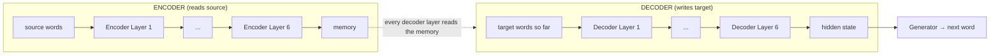
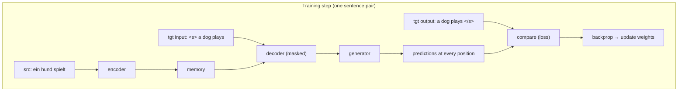

# 00 · The Big Picture

**Goal of the model:** read a sentence in one language, write it in another.

The Transformer does this with **two towers**:

- an **encoder** that reads the whole source sentence at once and turns it into a
  set of "meaning vectors" (one per source word), called the **memory**;
- a **decoder** that writes the translation **one word at a time**, each step
  looking at (a) the words it has written so far and (b) the encoder's memory.

Paper: **Attention Is All You Need**, Vaswani et al., 2017 —
<https://arxiv.org/abs/1706.03762>.
Original walkthrough this repo is based on: **The Annotated Transformer** —
<https://nlp.seas.harvard.edu/annotated-transformer/>.

---

## Why "Transformer" and not an RNN?

Older translation models (RNNs, LSTMs) read a sentence **word by word, in order**.
That is slow (you can't parallelise across time) and long-distance links are hard
("the *keys* … which I left on the table … *are* gone").

The Transformer throws away recurrence. Every word can look **directly** at every
other word in **one step**, using an operation called **attention**. This is:

- **fast** — all positions computed in parallel;
- **good at long distance** — "keys … are" is one attention hop, not twelve.

The trade-off: attention alone has no idea what **order** the words came in, so we
have to add that information back manually ([positional encoding](04-positional-encoding.md)).

---

## The two towers

One **encoder layer** has 2 steps: self-attention, then a small feed-forward net.
One **decoder layer** has 3 steps: masked self-attention, attention over the
memory, then a small feed-forward net. Six of each are stacked.

Code that wires all of this together:
[`model/build.py`](../annotated_transformer/model/build.py) (`make_model`).

---

## Training vs. inference — an important difference

**During inference** (real translation) the decoder is a loop: predict "a", feed
it back, predict "dog", feed it back, predict "plays", feed it back, predict
`</s>`, stop. See [15-greedy-decoding.md](15-greedy-decoding.md).

**During training** we already know the correct answer is "a dog plays", so we
don't loop. We feed the **whole** target sentence in at once and ask the model to
predict every next-word in parallel. To stop it from "cheating" by looking at
future words, we use a **causal mask** ([02-batching-and-masking.md](02-batching-and-masking.md)).

This trick — "teacher forcing" with a mask — is why training is fast.

Notice the target is used **twice, shifted by one**:
- **input** to the decoder: `<s> a dog plays`
- **correct output** to compare against: `a dog plays </s>`

So at the position where the decoder sees `<s>` it must predict `a`; where it
sees `a` it must predict `dog`; and so on. That shift is built in
[`data/batch.py`](../annotated_transformer/data/batch.py).

---

## What each page covers

| Stage | Pages |
|-------|-------|
| Turning text into model input | 01, 02 |
| Turning input numbers into vectors the model can work with | 03, 04 |
| The one operation that makes it all work | 05, 06 |
| The other parts of a layer | 07, 08 |
| Assembling layers into towers | 09, 10, 11 |
| Teaching the model | 12, 13, 14 |
| Using the trained model | 15, 16 |

**Next:** [01 · Tokenization and Vocabulary →](01-tokenization-and-vocab.md)
