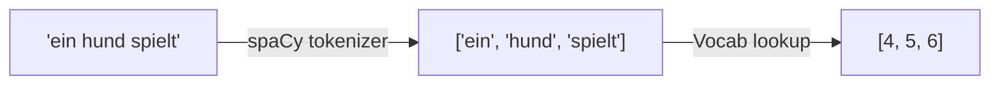
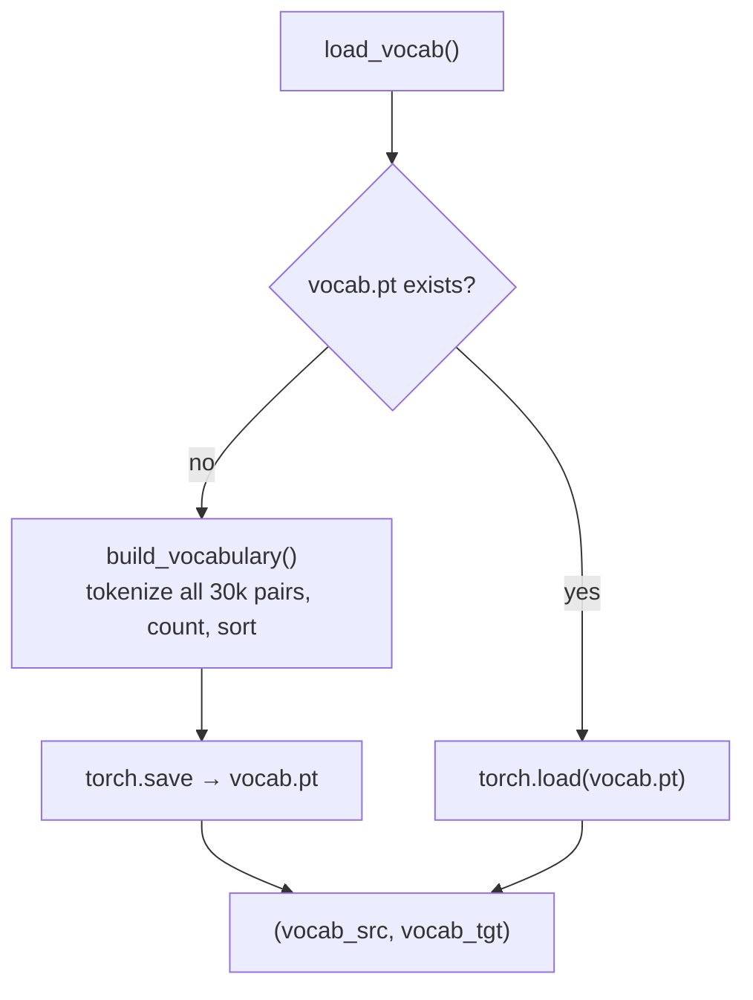

# 01 · Tokenization and Vocabulary

**Job:** turn a string of text into a list of integers the model can process.

Two small steps:

1. **Tokenize** — split text into pieces ("tokens").
2. **Numericalize** — look each token up in a **vocabulary** to get an integer id.

Code: [`data/tokenizer.py`](../annotated_transformer/data/tokenizer.py) and
[`data/vocab.py`](../annotated_transformer/data/vocab.py).



---

## Step 1 — Tokenize

We use [spaCy](https://spacy.io/) with a German model (`de_core_news_sm`) and an
English model (`en_core_web_sm`). spaCy is smarter than `str.split()`: it
separates punctuation, handles contractions, etc.

```python
def tokenize(text, tokenizer):
    return [tok.text for tok in tokenizer.tokenizer(text)]
```

**Example**

| Input text | Tokens |
|---|---|
| `ein hund spielt` | `['ein', 'hund', 'spielt']` |
| `Ein Hund spielt im Park.` | `['Ein', 'Hund', 'spielt', 'im', 'Park', '.']` |

Note the `.` becomes its own token, and `Ein` ≠ `ein` (case matters here — this
copy of the notebook does not lowercase).

---

## Step 2 — Build a vocabulary

A **vocabulary** is just two dictionaries:

- `stoi` — **s**tring **to** **i**nteger, e.g. `{"ein": 4, "hund": 5, ...}`
- `itos` — **i**nteger **to** **s**tring, the reverse

[`build_vocabulary`](../annotated_transformer/data/vocab.py) walks the whole
Multi30k dataset, counts how often every token appears, and assigns ids in order
of frequency (most common word gets the smallest id after the specials).

### The four special tokens come first

```python
SPECIALS = ["<s>", "</s>", "<blank>", "<unk>"]   # ids 0, 1, 2, 3
```

| id | token | used for |
|----|-------|----------|
| 0 | `<s>` | marks the **start** of a sentence |
| 1 | `</s>` | marks the **end** of a sentence |
| 2 | `<blank>` | **padding** — filler so all sentences in a batch are the same length ([page 02](02-batching-and-masking.md)) |
| 3 | `<unk>` | any word **not in the vocabulary** ("unknown") |

### Unknown words

`Vocab.__getitem__` falls back to id `3` when a token is missing:

```python
def __getitem__(self, token):
    return self.stoi.get(token, self.default_idx)   # default_idx = 3 = <unk>
```

**Example**

```
tokens:  ['ein', 'hund', 'frisbee']      # 'frisbee' was never seen in training
ids:     [ 4,     5,      3        ]      # 3 = <unk>
```

---

## Our running example, fully numericalized

Using the tiny vocab from the [docs README](README.md):

```
German source:   ein hund spielt
  tokens:        ['ein', 'hund', 'spielt']
  ids:           [4, 5, 6]

English target:  a dog plays
  tokens:        ['a', 'dog', 'plays']
  ids:           [4, 5, 6]
```

The start/end tokens are added later, during batching, giving `0 4 5 6 1`.

---

## Caching

Building the vocab means tokenizing ~30k sentence pairs, which is slow.
[`load_vocab`](../annotated_transformer/data/vocab.py) does it once and saves the
result to `vocab.pt`; every later run just loads that file.



---

## A note on real systems: subword tokenization (BPE)

Splitting on whole words gives a **huge** vocabulary and still can't handle rare
or novel words (every unseen word becomes `<unk>`). Production models instead
split into **subword units** so any word can be built from pieces:

```
"unbelievable"  →  ["un", "believ", "able"]
```

The paper uses **byte-pair encoding (BPE)** / word-pieces with a shared ~37k
vocabulary. Worth reading:

- **Neural Machine Translation of Rare Words with Subword Units** (BPE), Sennrich
  et al., 2016 — <https://arxiv.org/abs/1508.07909>
- **Google's Neural Machine Translation System** (word-piece), Wu et al., 2016 —
  <https://arxiv.org/abs/1609.08144>

This repo keeps whole-word tokenization because it is simpler to read and the
Multi30k dataset is tiny.

---

## In one sentence

Tokenization + vocabulary is a lookup table that turns `"ein hund spielt"` into
`[4, 5, 6]`, with fixed slots for start, end, padding, and unknown.

**Next:** [02 · Batching and Masking →](02-batching-and-masking.md)
