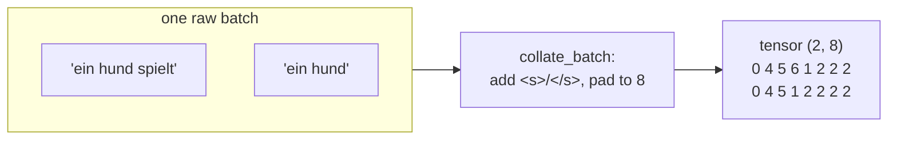
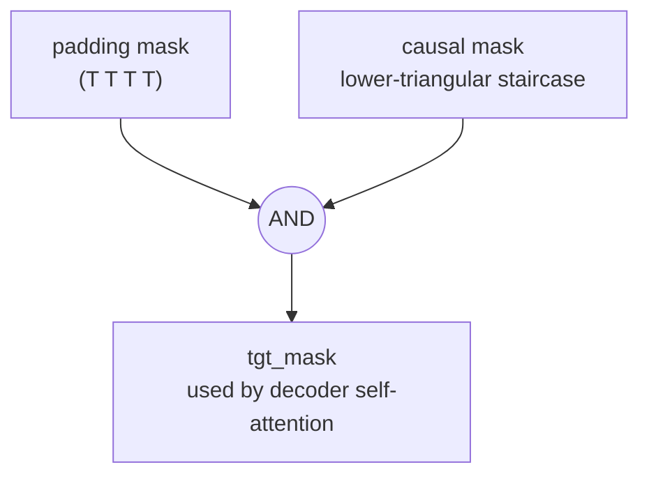

# 02 · Batching and Masking

**Job:** stack many sentences of different lengths into one rectangular tensor,
and build the **masks** that tell attention which positions to ignore.

Code: [`data/dataloader.py`](../annotated_transformer/data/dataloader.py)
(`collate_batch`), [`data/batch.py`](../annotated_transformer/data/batch.py)
(`Batch`), [`model/masking.py`](../annotated_transformer/model/masking.py)
(`subsequent_mask`).

---

## Step 1 — Add `<s>` / `</s>` and pad to equal length

Sentences in a batch have different lengths, but a tensor must be a rectangle.
So we wrap each sentence with start/end tokens and **pad** the short ones with
`<blank>` (id 2) up to a fixed `max_padding`.

```python
# collate_batch, simplified
processed = [<s>]  +  vocab(tokens)  +  [</s>]
padded    = processed + [<blank>] * (max_padding - len(processed))
```

**Example** — a batch of two German sentences, `max_padding = 8`:

```
"ein hund spielt"     →  0  4  5  6  1  2  2  2
"ein hund"            →  0  4  5  1  2  2  2  2
                         ↑           ↑  ↑─────↑
                        <s>        </s>  padding
```

Stacked, that batch is a tensor of shape `(2, 8)`.



---

## Step 2 — The `Batch` object

[`Batch`](../annotated_transformer/data/batch.py) takes the padded `src` and
`tgt` tensors and precomputes everything training needs.

### 2a. Source mask — "ignore the padding"

```python
self.src_mask = (src != pad).unsqueeze(-2)
```

`True` where there is a real token, `False` where there is padding. Attention
will use this to give padding positions zero weight.

```
src:       0  4  5  6  1  2  2  2
src_mask:  T  T  T  T  T  F  F  F
```

### 2b. Target: shift by one (teacher forcing)

```python
self.tgt   = tgt[:, :-1]     #  <s> a  dog plays        ← decoder INPUT
self.tgt_y = tgt[:, 1:]      #  a   dog plays </s>      ← what to PREDICT
```

At each position the decoder sees one token and must predict the next:

| position | decoder sees (`tgt`) | must predict (`tgt_y`) |
|---|---|---|
| 0 | `<s>` | `a` |
| 1 | `a` | `dog` |
| 2 | `dog` | `plays` |
| 3 | `plays` | `</s>` |

### 2c. Target mask — "ignore padding **and** the future"

```python
tgt_mask = (tgt != pad).unsqueeze(-2)                       # padding mask
tgt_mask = tgt_mask & subsequent_mask(tgt.size(-1))         # AND causal mask
```

Two masks combined with logical AND.

### 2d. Token count

```python
self.ntokens = (self.tgt_y != pad).data.sum()
```

How many **real** (non-padding) target tokens are in this batch. The loss is
divided by this so batches with more padding aren't unfairly cheap or expensive.

---

## The causal ("subsequent") mask

During training the decoder sees the whole target at once. Without a mask,
position 1 ("a") could peek at position 2 ("dog") — and predicting "dog" from an
input that contains "dog" is cheating. The **subsequent mask** blocks every
position from seeing anything to its right.

```python
def subsequent_mask(size):
    attn_shape = (1, size, size)
    subsequent = torch.triu(torch.ones(attn_shape), diagonal=1).type(torch.bool)
    return subsequent == 0     # True = allowed, False = blocked
```

For `size = 4` (our target `<s> a dog plays`):

```
            can attend to →
            <s>   a   dog  plays
   <s>  [    T    F    F    F   ]
   a    [    T    T    F    F   ]
   dog  [    T    T    T    F   ]
   plays[    T    T    T    T   ]
```

Row "a" can look at `<s>` and "a", but **not** "dog" or "plays". It's a staircase.



---

## How a mask is actually applied

Inside attention ([page 05](05-scaled-dot-product-attention.md)):

```python
scores = scores.masked_fill(mask == 0, -1e9)   # blocked cells → -1e9
p_attn = scores.softmax(dim=-1)                 # softmax(-1e9) ≈ 0
```

Blocked positions get a score of negative infinity, so after softmax their
attention weight is effectively **zero**. They contribute nothing.

---

## Research background

- **Attention Is All You Need** §3.1 (decoder masking) —
  <https://arxiv.org/abs/1706.03762>
- The shift-by-one + mask idea ("teacher forcing") predates Transformers; see
  **Professor Forcing**, Lamb et al., 2016 — <https://arxiv.org/abs/1610.09038>
  for a discussion of its trade-offs.
- Multi30k dataset: **Multi30K: Multilingual English-German Image Descriptions**,
  Elliott et al., 2016 — <https://arxiv.org/abs/1605.00459>

---

## In one sentence

Batching pads every sentence to the same length; the `Batch` object then builds a
**padding mask** ("ignore filler") and, for the target, a **causal mask**
("don't look at future words") so training can process a whole sentence at once
without cheating.

**Next:** [03 · Embeddings →](03-embeddings.md)
