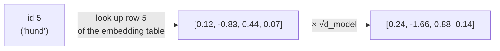
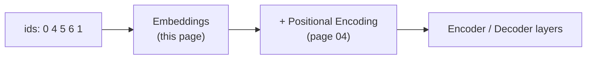

# 03 · Embeddings

**Job:** turn each word-id (a single integer) into a vector of `d_model` numbers
that the network can actually do maths on.

Code: [`model/embeddings.py`](../annotated_transformer/model/embeddings.py)
(`Embeddings`).



---

## What is an embedding table?

It is a big matrix of shape `(vocab_size, d_model)` — one **row per word** — and
every number in it is a **learned parameter**. "Looking up" word id `i` just means
"take row `i`".

```python
class Embeddings(nn.Module):
    def __init__(self, d_model, vocab):
        self.lut = nn.Embedding(vocab, d_model)   # the table
        self.d_model = d_model

    def forward(self, x):
        return self.lut(x) * math.sqrt(self.d_model)
```

`lut` = "look-up table".

At the start of training the rows are random. As the model trains, words used in
similar ways drift to similar vectors ("dog" ends up near "cat", far from "run").

---

## Worked example (`d_model = 4`)

Suppose after some training the English embedding table has these rows:

| id | word | embedding row |
|----|------|---------------|
| 0 | `<s>` | `[ 0.01,  0.00, -0.02,  0.01]` |
| 4 | a | `[ 0.20, -0.10,  0.05,  0.30]` |
| 5 | dog | `[-0.40,  0.60,  0.10, -0.20]` |
| 6 | plays | `[ 0.30,  0.30, -0.50,  0.10]` |

Decoder input ids `[0, 4, 5]` (`<s> a dog`) become a `(3, 4)` matrix:

```
<s>  →  [ 0.01,  0.00, -0.02,  0.01]
a    →  [ 0.20, -0.10,  0.05,  0.30]
dog  →  [-0.40,  0.60,  0.10, -0.20]
```

Then every number is multiplied by `√d_model = √4 = 2`:

```
<s>  →  [ 0.02,  0.00, -0.04,  0.02]
a    →  [ 0.40, -0.20,  0.10,  0.60]
dog  →  [-0.80,  1.20,  0.20, -0.40]
```

Shape in, shape out: `(batch, seq_len)` → `(batch, seq_len, d_model)`.

---

## Why multiply by √d_model?

Two reasons, both about **keeping numbers at a sensible size**:

1. **Balance against positional encoding.** The next step
   ([page 04](04-positional-encoding.md)) *adds* a positional signal whose values
   sit in `[-1, 1]`. Freshly initialised embeddings are small (std ≈
   `1/√d_model`). Scaling the embedding up by `√d_model` makes it std ≈ 1, so the
   word signal and the position signal are comparable — neither drowns the other.

2. **Weight tying.** The paper shares one matrix between the input embedding and
   the final output projection ([page 11](11-generator-and-full-model.md)). Those
   two uses want different scales; the `√d_model` factor reconciles them.
   See **Using the Output Embedding to Improve Language Models**, Press & Wolf,
   2017 — <https://arxiv.org/abs/1608.05859>.

---

## Where it sits in the model



In [`make_model`](../annotated_transformer/model/build.py) the embedding and the
positional encoding are bundled with `nn.Sequential`:

```python
nn.Sequential(Embeddings(d_model, src_vocab), c(position))
```

so `model.src_embed(src)` does *both* the lookup and the position-add in one call.

---

## Research background

- **Attention Is All You Need** §3.4 ("Embeddings and Softmax") —
  <https://arxiv.org/abs/1706.03762>
- The idea that learned dense vectors capture word meaning: **Efficient
  Estimation of Word Representations in Vector Space** (word2vec), Mikolov et al.,
  2013 — <https://arxiv.org/abs/1301.3781>
- Weight tying: <https://arxiv.org/abs/1608.05859>

---

## In one sentence

An embedding is a learned lookup table: word id → vector; the `√d_model` scaling
keeps that vector the same size as the positional signal it's about to be added
to.

**Next:** [04 · Positional Encoding →](04-positional-encoding.md)
