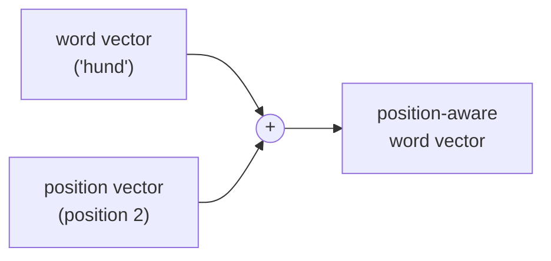

# 04 · Positional Encoding

**Job:** tell the model **where** each word sits in the sentence.

Code: [`model/embeddings.py`](../annotated_transformer/model/embeddings.py)
(`PositionalEncoding`).

---

## Why we need it

Attention ([page 05](05-scaled-dot-product-attention.md)) treats its input as a
**bag of words** — it has no built-in notion of order. To attention,
"dog bites man" and "man bites dog" look the same.

RNNs got order for free by processing left-to-right. The Transformer gave that up
for speed, so we must **add order information back** into the vectors.

The fix: add a second vector to each word embedding that depends only on the
**position** (1st word, 2nd word, ...), not on the word itself.



---

## The formula (sine and cosine waves)

For position `pos` and embedding dimension `i`:

```
PE(pos, 2i)   = sin( pos / 10000^(2i / d_model) )     ← even dimensions
PE(pos, 2i+1) = cos( pos / 10000^(2i / d_model) )     ← odd dimensions
```

Plain-English reading:

- Each **dimension** of the vector is a wave.
- **Low** dimensions are **fast** waves (short wavelength); **high** dimensions
  are **slow** waves (long wavelength, up to ~10000·2π).
- So the full vector for a position is like a **binary-clock / odometer**: fast
  digits and slow digits together give every position a unique fingerprint.

```python
pe = torch.zeros(max_len, d_model)
position = torch.arange(0, max_len).unsqueeze(1)
div_term = torch.exp(torch.arange(0, d_model, 2) * -(math.log(10000.0) / d_model))
pe[:, 0::2] = torch.sin(position * div_term)   # even columns
pe[:, 1::2] = torch.cos(position * div_term)   # odd  columns
```

It's computed **once** up to `max_len = 5000` and stored as a buffer (not a
trainable parameter — these values never change).

---

## Worked example (`d_model = 4`)

`div_term` for dims (0, 2): `[1.0, 0.01]`.

| pos | dim0 = sin(pos·1) | dim1 = cos(pos·1) | dim2 = sin(pos·0.01) | dim3 = cos(pos·0.01) |
|-----|------------------|------------------|----------------------|----------------------|
| 0   | 0.000            | 1.000            | 0.000                | 1.000                |
| 1   | 0.841            | 0.540            | 0.010                | 1.000                |
| 2   | 0.909            | −0.416           | 0.020                | 1.000                |
| 3   | 0.141            | −0.990           | 0.030                | 1.000                |

Notice dims 0–1 swing wildly between positions (fast wave), dims 2–3 barely move
(slow wave). Together they pin down the position.

### Adding it to our sentence

From [page 03](03-embeddings.md), the scaled embeddings for `<s> a dog` were:

```
<s>  [ 0.02,  0.00, -0.04,  0.02]
a    [ 0.40, -0.20,  0.10,  0.60]
dog  [-0.80,  1.20,  0.20, -0.40]
```

Add the position rows (pos 0, 1, 2 from the table above):

```
<s>  [ 0.02,  0.00, -0.04,  0.02] + [0.000,  1.000, 0.000, 1.000] = [ 0.02,  1.00, -0.04,  1.02]
a    [ 0.40, -0.20,  0.10,  0.60] + [0.841,  0.540, 0.010, 1.000] = [ 1.24,  0.34,  0.11,  1.60]
dog  [-0.80,  1.20,  0.20, -0.40] + [0.909, -0.416, 0.020, 1.000] = [ 0.11,  0.78,  0.22,  0.60]
```

These position-aware vectors are what the first attention layer actually sees.

```python
def forward(self, x):
    x = x + self.pe[:, : x.size(1)].requires_grad_(False)
    return self.dropout(x)
```

(There is also a dropout here — see [page 08](08-layernorm-residual-dropout.md).)

---

## Why waves instead of just the number "1, 2, 3, ..."?

- Raw position numbers grow without bound; `sin`/`cos` stay in `[-1, 1]`, matching
  the embedding scale.
- **Relative positions are easy to learn.** For any fixed offset `k`,
  `PE(pos + k)` is a fixed linear function of `PE(pos)` (a rotation). So the model
  can learn "attend to the word 3 positions back" as a simple operation.
- It **extrapolates**: positions longer than anything seen in training still get a
  sensible, unique code.

---

## Alternatives (what real models do now)

- **Learned** positional embeddings — a trainable row per position. The paper
  tried this and got "nearly identical results".
  See ConvS2S, Gehring et al., 2017 — <https://arxiv.org/abs/1705.03122>.
- **Rotary Position Embedding (RoPE)** — rotates Q/K by an angle proportional to
  position; used in LLaMA, GPT-NeoX. **RoFormer**, Su et al., 2021 —
  <https://arxiv.org/abs/2104.09864>.
- **ALiBi** — bias attention scores by distance, no position vectors at all.
  Press et al., 2021 — <https://arxiv.org/abs/2108.12409>.

---

## Research background

- **Attention Is All You Need** §3.5 — <https://arxiv.org/abs/1706.03762>
- Visual intuition: **The Illustrated Transformer**, Jay Alammar —
  <https://jalammar.github.io/illustrated-transformer/>

---

## In one sentence

We add a fixed vector of sine/cosine waves to each word so that otherwise
order-blind attention can tell the 1st word from the 5th, and can learn
"look `k` words back".

**Next:** [05 · Scaled Dot-Product Attention →](05-scaled-dot-product-attention.md)
