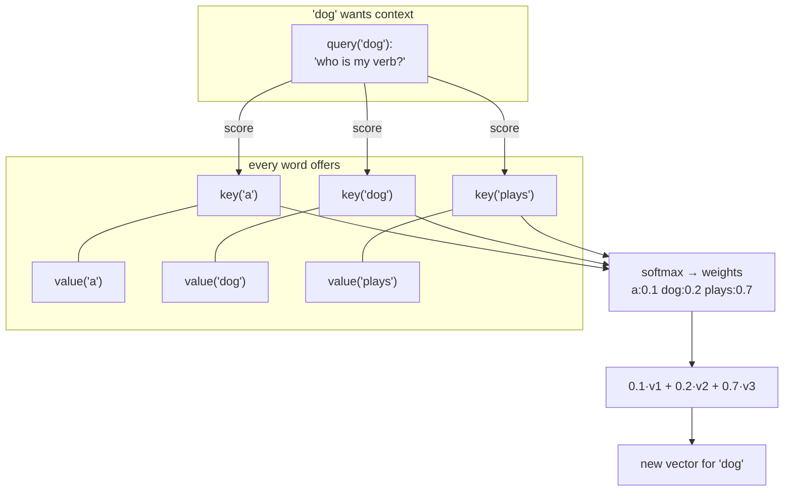
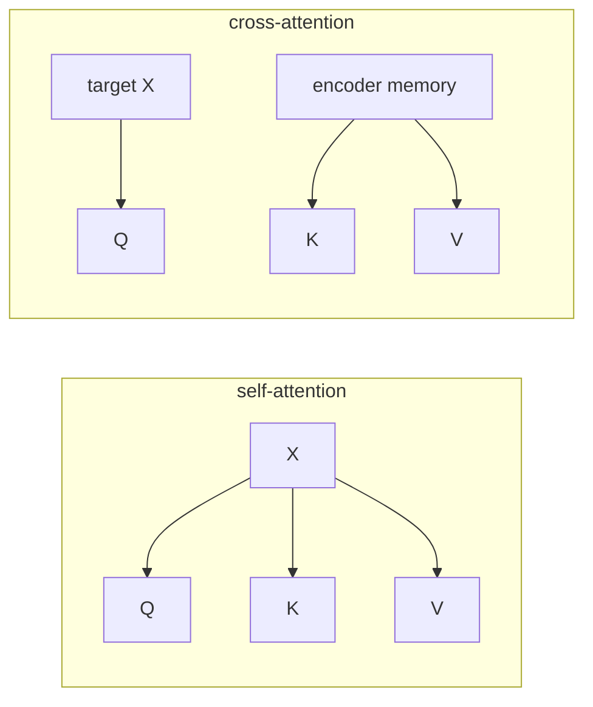

# 05 · Scaled Dot-Product Attention

This is **the** core operation of the Transformer. Everything else is support.

Code: [`model/attention.py`](../annotated_transformer/model/attention.py)
(`attention`).

---

## The idea in one picture

Every word asks a **question** and every word offers a **key** and some
**content**. A word's new vector is a blend of everyone's content, weighted by how
well their key answers its question.



**Query (Q), Key (K), Value (V)** are three different linear projections of the
input vectors — see [page 06](06-multi-head-attention.md) for where they come
from. On this page, take them as given.

---

## The formula

```
Attention(Q, K, V) = softmax( Q · Kᵀ / √d_k ) · V
```

Step by step:

| # | Operation | Meaning | Shape |
|---|-----------|---------|-------|
| 1 | `Q · Kᵀ` | every query dot every key → **raw match scores** | `(seq_q, seq_k)` |
| 2 | `/ √d_k` | shrink the scores (see below) | `(seq_q, seq_k)` |
| 3 | `masked_fill` | set blocked cells to −1e9 ([page 02](02-batching-and-masking.md)) | `(seq_q, seq_k)` |
| 4 | `softmax` | turn each row of scores into weights that sum to 1 | `(seq_q, seq_k)` |
| 5 | `· V` | weighted average of the value vectors | `(seq_q, d_v)` |

```python
def attention(query, key, value, mask=None, dropout=None):
    d_k = query.size(-1)
    scores = torch.matmul(query, key.transpose(-2, -1)) / math.sqrt(d_k)
    if mask is not None:
        scores = scores.masked_fill(mask == 0, -1e9)
    p_attn = scores.softmax(dim=-1)
    if dropout is not None:
        p_attn = dropout(p_attn)
    return torch.matmul(p_attn, value), p_attn
```

It returns **two** things: the new vectors, and `p_attn` (the weight matrix) —
kept so we can [visualise it later](16-attention-visualization.md).

---

## Worked example (`d_k = 2`, one head, no mask)

Say the three source words `ein hund spielt` have these Q, K, V after projection
(made-up numbers):

```
        query Q            key K              value V
ein    [1.0, 0.0]        [1.0, 0.0]        [0.2, 0.9]
hund   [0.0, 1.0]        [0.0, 1.0]        [0.7, 0.1]
spielt [1.0, 1.0]        [1.0, 1.0]        [0.4, 0.4]
```

**Step 1–2: scores = Q·Kᵀ / √2**  (√2 ≈ 1.414)

Take the query for **hund** = `[0.0, 1.0]`:

```
hund·ein   = 0·1 + 1·0 = 0.00   → /1.414 = 0.00
hund·hund  = 0·0 + 1·1 = 1.00   → /1.414 = 0.71
hund·spielt= 0·1 + 1·1 = 1.00   → /1.414 = 0.71
```

**Step 4: softmax([0.00, 0.71, 0.71])**

```
exp:  [1.00, 2.03, 2.03]      sum = 5.06
weights: [0.20, 0.40, 0.40]
```

So "hund" pays 20% attention to "ein", 40% to itself, 40% to "spielt".

**Step 5: weighted sum of V**

```
0.20·[0.2, 0.9] + 0.40·[0.7, 0.1] + 0.40·[0.4, 0.4]
= [0.04, 0.18] + [0.28, 0.04] + [0.16, 0.16]
= [0.48, 0.38]      ← new vector for 'hund'
```

The word "hund" has now absorbed information from "spielt" — it knows its verb.

---

## Why divide by √d_k? ("scaled")

If Q and K have `d_k` components each of size ~1, their dot product has variance
~`d_k`, so with `d_k = 64` the raw scores swing by ±8 or more. Feed numbers that
large into softmax and it becomes **razor-sharp** — almost all weight on one word,
near-zero gradient everywhere else, so learning stalls.

Dividing by `√d_k` rescales the scores back to variance ~1, keeping softmax soft
and gradients healthy. (Paper §3.2.1.)

**Tiny illustration:** `softmax([1, 2])` = `[0.27, 0.73]` (soft), but
`softmax([10, 20])` = `[0.00005, 0.99995]` (a hard max, dead gradient).

---

## Self-attention vs. cross-attention

Same function, different inputs:

| Used in | Q comes from | K, V come from | Purpose |
|---------|--------------|----------------|---------|
| Encoder self-attention | source words | source words | each source word gathers context from the sentence |
| Decoder **masked** self-attention | target words so far | target words so far | each output word looks at earlier output words |
| Decoder cross-attention | target words | **encoder memory** | each output word looks at the source sentence |



---

## Research background

- **Attention Is All You Need** §3.2.1 — <https://arxiv.org/abs/1706.03762>
- The predecessor (additive attention over an RNN): **Neural Machine Translation
  by Jointly Learning to Align and Translate**, Bahdanau et al., 2014 —
  <https://arxiv.org/abs/1409.0473>
- Multiplicative attention: **Effective Approaches to Attention-based NMT**, Luong
  et al., 2015 — <https://arxiv.org/abs/1508.04025>
- Why scaling matters at large `d_k`: paper §3.2.1 footnote; see also **Query-Key
  Normalization**, Henry et al., 2020 — <https://arxiv.org/abs/2010.04245>

---

## In one sentence

Attention gives each word a new vector that is a **weighted average of every
word's value**, where the weights come from how well queries and keys match,
divided by `√d_k` to keep the softmax from going all-or-nothing.

**Next:** [06 · Multi-Head Attention →](06-multi-head-attention.md)
