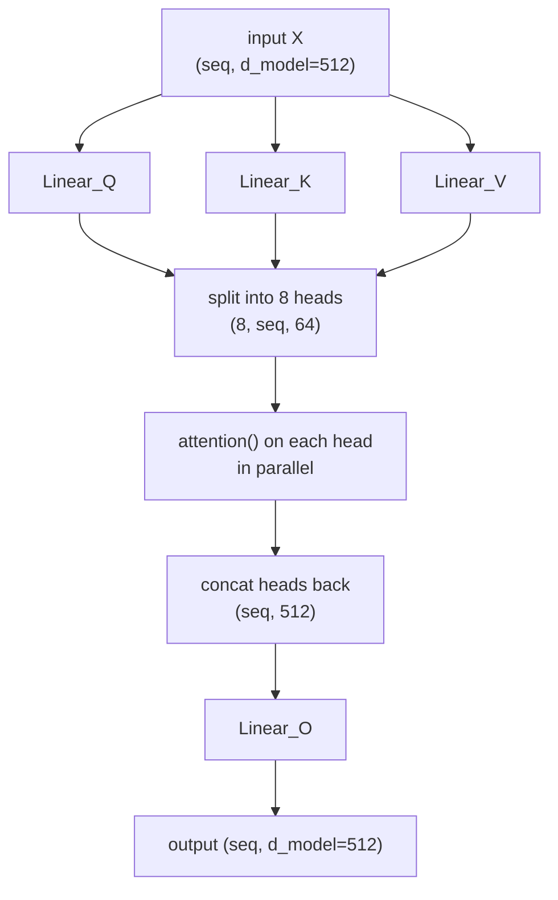
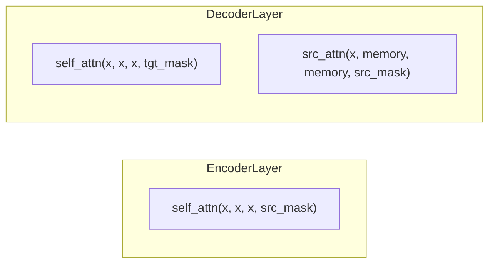

# 06 · Multi-Head Attention

**Job:** run [scaled dot-product attention](05-scaled-dot-product-attention.md)
**several times in parallel** ("heads"), each in its own smaller subspace, then
combine the results.

Code: [`model/attention.py`](../annotated_transformer/model/attention.py)
(`MultiHeadedAttention`).

---

## Why more than one head?

A single attention can only average one way. But a word often needs **different
kinds** of context at once:

- "plays" needs its **subject** ("dog")
- "plays" needs its **object** / adverb
- "plays" needs **agreement** info (singular? tense?)

Give the model 8 heads and each can specialise: head 1 tracks subjects, head 3
tracks nearby words, head 5 tracks punctuation, etc. (In practice the split is
messier than that, but the capacity is there.)

Paper §3.2.2: with `h = 8` heads and `d_k = d_model / h = 64`, the total cost is
about the same as one full-size head.

---

## The four steps



1. **Project** X three times (Q, K, V) with learned `d_model × d_model` linears.
2. **Split** each projection into `h` chunks of width `d_k` — that's the heads.
3. **Attend** — run `attention()` on all heads at once (it's just batched matmuls).
4. **Concat + project** — glue the heads back together and pass through a final
   linear `Linear_O`.

```python
def forward(self, query, key, value, mask=None):
    if mask is not None:
        mask = mask.unsqueeze(1)           # same mask for every head
    nbatches = query.size(0)

    # 1 + 2: project, then reshape (batch, seq, 512) -> (batch, 8, seq, 64)
    query, key, value = [
        lin(x).view(nbatches, -1, self.h, self.d_k).transpose(1, 2)
        for lin, x in zip(self.linears, (query, key, value))
    ]

    # 3: attention on every head
    x, self.attn = attention(query, key, value, mask=mask, dropout=self.dropout)

    # 4: (batch, 8, seq, 64) -> (batch, seq, 512), then final linear
    x = x.transpose(1, 2).contiguous().view(nbatches, -1, self.h * self.d_k)
    return self.linears[-1](x)
```

> `self.linears` is **4** cloned linear layers: three for Q/K/V, one for the
> output. `self.attn` stashes the last weight matrix for
> [visualisation](16-attention-visualization.md).

---

## Worked example (`d_model = 4`, `h = 2`, so `d_k = 2`)

Input: the 3 position-aware source vectors (width 4).

**Step 1 — project to Q** (multiply by the learned 4×4 `Linear_Q`). Say we get:

```
        Q (width 4)
ein    [1.0, 0.0 | 0.5, 0.5]
hund   [0.0, 1.0 | 0.2, 0.9]
spielt [1.0, 1.0 | 0.1, 0.1]
```

**Step 2 — split into 2 heads** at the `|`:

```
head 0 (dims 0-1)          head 1 (dims 2-3)
ein    [1.0, 0.0]          ein    [0.5, 0.5]
hund   [0.0, 1.0]          hund   [0.2, 0.9]
spielt [1.0, 1.0]          spielt [0.1, 0.1]
```

**Step 3 — attention runs independently on each head.** Head 0 might decide
"hund" should attend mostly to "spielt" (verb linking); head 1 might have "hund"
attend mostly to itself. Each produces a width-2 output vector per word.

**Step 4 — concat** the two width-2 outputs back to width 4, then multiply by the
learned `Linear_O`:

```
head0_out('hund')  ++  head1_out('hund')   =  [0.48, 0.38, 0.20, 0.85]
                                              └────── Linear_O ──────┘
                                              →  final new vector for 'hund'
```

Shape journey: `(batch, 3, 4)` → `(batch, 2, 3, 2)` → attend → `(batch, 2, 3, 2)`
→ `(batch, 3, 4)` → `(batch, 3, 4)`.

---

## The three places it's used

From [`make_model`](../annotated_transformer/model/build.py) — the **same class**,
wired three ways:



| Call | Q | K | V | mask |
|------|---|---|---|------|
| encoder self-attention | x | x | x | padding only |
| decoder self-attention | x | x | x | padding **+ causal** |
| decoder cross-attention | x | memory | memory | source padding |

---

## Research background

- **Attention Is All You Need** §3.2.2 — <https://arxiv.org/abs/1706.03762>
- **Are Sixteen Heads Really Better than One?**, Michel et al., 2019 — many heads
  can be pruned after training — <https://arxiv.org/abs/1905.10650>
- **A Multiscale Visualization of Attention** (BertViz), Vig, 2019 —
  <https://arxiv.org/abs/1906.05714>
- **What Does BERT Look At?**, Clark et al., 2019 — heads learn interpretable
  syntax — <https://arxiv.org/abs/1906.04341>

---

## In one sentence

Multi-head attention slices the vectors into `h` smaller pieces, runs attention on
each piece separately so different heads can capture different relationships, then
concatenates and mixes the results with one more linear layer.

**Next:** [07 · Position-wise Feed-Forward →](07-position-wise-feed-forward.md)
