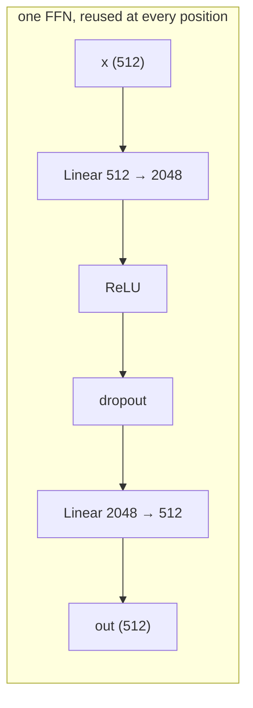
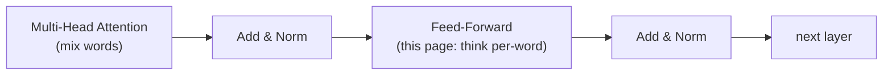

# 07 · Position-wise Feed-Forward Network

**Job:** after a word has gathered context from attention, give it a little
private "thinking space" — a 2-layer neural net applied to **each word on its
own**.

Code: [`model/feed_forward.py`](../annotated_transformer/model/feed_forward.py)
(`PositionwiseFeedForward`).

---

## What "position-wise" means

The **same** tiny MLP is applied to every position independently. Word 1's vector
goes through it, word 2's vector goes through it, ... — no mixing between words
here. (Attention already did the mixing.)



```python
class PositionwiseFeedForward(nn.Module):
    def __init__(self, d_model, d_ff, dropout=0.1):
        self.w_1 = nn.Linear(d_model, d_ff)     # 512 → 2048   (expand)
        self.w_2 = nn.Linear(d_ff, d_model)     # 2048 → 512   (contract)
        self.dropout = nn.Dropout(dropout)

    def forward(self, x):
        return self.w_2(self.dropout(self.w_1(x).relu()))
```

The formula: `FFN(x) = max(0, x·W₁ + b₁)·W₂ + b₂`.

- **Expand** 512 → 2048: gives the network room to compute many little features.
- **ReLU** (`max(0, ·)`): the non-linearity — without it, two linear layers would
  collapse into one.
- **Contract** 2048 → 512: back to model width so the next layer fits.

Every layer has its **own** `w_1` / `w_2` (they are not shared across the 6
layers).

---

## Worked example (`d_model = 4`, `d_ff = 8`)

Input: the post-attention vector for **hund**, `x = [0.48, 0.38, 0.20, 0.85]`.

**`w_1`: 4 → 8** (made-up weights) might give:

```
x·W₁ + b₁ = [ 0.9, -0.3,  1.2, -0.1,  0.4, -0.7,  0.6,  0.2]
```

**ReLU** zeroes the negatives:

```
[ 0.9,  0.0,  1.2,  0.0,  0.4,  0.0,  0.6,  0.2]
```

**`w_2`: 8 → 4** contracts back:

```
out = [0.55, -0.12, 0.33, 0.71]
```

Shape in = shape out = `(batch, seq, 4)`. Only the values changed — the word was
"reconsidered" in light of the context attention gave it.

---

## How big is it? (Most of the parameters live here)

For the base model: `w_1` is `512 × 2048` ≈ 1.05M params, `w_2` is `2048 × 512` ≈
1.05M. That's ~2.1M per layer × 6 layers × 2 towers ≈ **25M** parameters — roughly
**two-thirds of the whole model**. Attention is cheap; the FFN is where the
"knowledge" mostly sits.

This is exactly why Mixture-of-Experts models (Switch Transformer, Mixtral)
replace this one FFN with many and route each token to a few — it's the fattest,
most parallelisable block.

---

## "Two convolutions with kernel size 1"

The paper notes an equivalent view: applying the same linear map to every
position **is** a 1-D convolution with a width-1 kernel. Same maths, different
name.

---

## Where it sits



Each of those two sub-blocks is wrapped in a residual + norm — see
[page 08](08-layernorm-residual-dropout.md).

---

## Research background

- **Attention Is All You Need** §3.3 — <https://arxiv.org/abs/1706.03762>
- ReLU: **Deep Sparse Rectifier Neural Networks**, Glorot et al., 2011 —
  <https://proceedings.mlr.press/v15/glorot11a.html>
- Newer variants swap ReLU for **GELU** (<https://arxiv.org/abs/1606.08415>) or
  **SwiGLU** (**GLU Variants Improve Transformer**, Shazeer, 2020 —
  <https://arxiv.org/abs/2002.05202>)
- The FFN as key-value memory: **Transformer Feed-Forward Layers Are Key-Value
  Memories**, Geva et al., 2020 — <https://arxiv.org/abs/2012.14913>
- MoE version: **Switch Transformers**, Fedus et al., 2021 —
  <https://arxiv.org/abs/2101.03961>

---

## In one sentence

After attention mixes information between words, the feed-forward network lets
each word process that information privately through an expand → ReLU → contract
MLP — and it holds most of the model's parameters.

**Next:** [08 · LayerNorm, Residuals, Dropout →](08-layernorm-residual-dropout.md)
