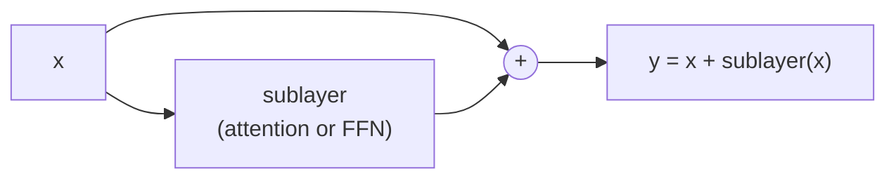
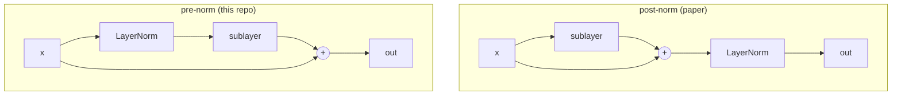

# 08 · LayerNorm, Residual Connections, Dropout

These three are the "plumbing" that makes a **deep** stack of layers actually
trainable. Individually simple; together essential.

Code: [`model/layers.py`](../annotated_transformer/model/layers.py)
(`LayerNorm`, `SublayerConnection`).

---

## 1. Residual connection ("Add")

Instead of `x → sublayer → output`, do `x → sublayer → output + x`. The layer only
has to learn a **change** to `x`, not rebuild it from scratch.



Why it matters: gradients flow straight back through the `+` (the "gradient
highway"), so a 12- or 100-layer stack still trains. Without residuals, deep nets
suffer vanishing gradients and get *worse* with depth.

Paper reference: **Deep Residual Learning for Image Recognition** (ResNet), He et
al., 2015 — <https://arxiv.org/abs/1512.03385>.

---

## 2. Layer Normalization ("Norm")

After adding, the numbers in a vector can drift to very different scales across
positions and layers. **LayerNorm** rescales **each vector** to mean 0, std 1,
then applies a learned scale `a_2` and shift `b_2`.

```python
class LayerNorm(nn.Module):
    def __init__(self, features, eps=1e-6):
        self.a_2 = nn.Parameter(torch.ones(features))   # learned scale
        self.b_2 = nn.Parameter(torch.zeros(features))  # learned shift
        self.eps = eps

    def forward(self, x):
        mean = x.mean(-1, keepdim=True)
        std  = x.std(-1, keepdim=True)
        return self.a_2 * (x - mean) / (std + self.eps) + self.b_2
```

### Worked example (`d_model = 4`)

Input vector `x = [0.02, 1.00, -0.04, 1.02]`.

```
mean = (0.02 + 1.00 - 0.04 + 1.02) / 4 = 0.50
std  ≈ 0.59
(x - mean) / std  =  [-0.81,  0.85, -0.92,  0.88]
```

With `a_2 = [1,1,1,1]`, `b_2 = [0,0,0,0]` (their initial values) that's the
output. Now every position's vector is on the same scale — stable input for the
next layer.

### LayerNorm vs. BatchNorm — why LayerNorm for NLP?

| | normalises over | depends on batch? | good for |
|---|---|---|---|
| **BatchNorm** | the batch, per feature | **yes** | fixed-size images |
| **LayerNorm** | the features, per example | **no** | variable-length text, small batches, RNNs |

Text batches have padding and vary in length, and inference often runs one
sentence at a time — BatchNorm's batch statistics would be unreliable. LayerNorm
treats every vector independently, so none of that matters.

- **Layer Normalization**, Ba, Kiros & Hinton, 2016 —
  <https://arxiv.org/abs/1607.06450>
- **Batch Normalization**, Ioffe & Szegedy, 2015 —
  <https://arxiv.org/abs/1502.03167>
- **PowerNorm: Rethinking Batch Normalization in Transformers**, Shen et al.,
  2020 — why BN struggles here — <https://arxiv.org/abs/2003.07845>

---

## 3. Putting them together — `SublayerConnection`

```python
class SublayerConnection(nn.Module):
    def __init__(self, size, dropout):
        self.norm = LayerNorm(size)
        self.dropout = nn.Dropout(dropout)

    def forward(self, x, sublayer):
        return x + self.dropout(sublayer(self.norm(x)))
```

Read the return line inside-out:

```
x  +  dropout( sublayer( norm(x) ) )
│              │         │
│              │         └─ normalise FIRST (pre-norm)
│              └─ then run attention / FFN, then drop some outputs
└─ then add the original x back
```

### Pre-norm vs. post-norm

The **paper** does `norm(x + sublayer(x))` — normalise **after** adding
("post-norm"). This repo (following the Annotated Transformer) does
`x + sublayer(norm(x))` — normalise **before** ("pre-norm"), which is why
[`Encoder`](../annotated_transformer/model/encoder.py) and `Decoder` apply one
extra `LayerNorm` at the very end.

Pre-norm is now the default everywhere because it trains more stably and often
needs no learning-rate warmup.

- **On Layer Normalization in the Transformer Architecture**, Xiong et al., 2020 —
  <https://arxiv.org/abs/2002.04745>



---

## 4. Dropout

During training, randomly set a fraction `p` (here **0.1**) of values to zero.
This stops the network relying on any single unit — a cheap, powerful regulariser.
It is **off** at inference (`model.eval()`).

The Transformer applies dropout in four spots: on attention weights
([page 05](05-scaled-dot-product-attention.md)), inside the FFN
([page 07](07-position-wise-feed-forward.md)), on each sublayer's output (above),
and on the embedding+positional sum ([page 04](04-positional-encoding.md)).

- **Dropout: A Simple Way to Prevent Neural Networks from Overfitting**,
  Srivastava et al., 2014 —
  <https://jmlr.org/papers/v15/srivastava14a.html>

---

## In one sentence

**Residual** = "learn a change, not a rewrite" (keeps gradients flowing);
**LayerNorm** = "rescale each vector to a standard size" (keeps activations
stable); **Dropout** = "randomly drop 10% while training" (prevents overfitting) —
and `SublayerConnection` wraps every attention/FFN block in all three.

**Next:** [09 · The Encoder Stack →](09-encoder-stack.md)
