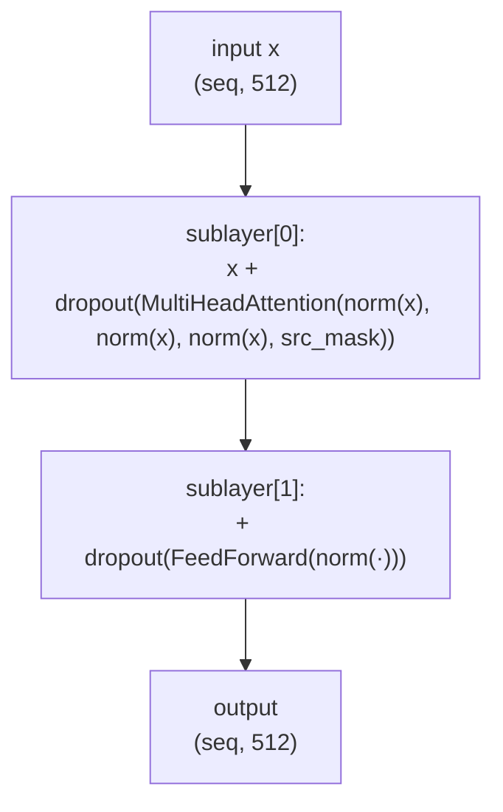
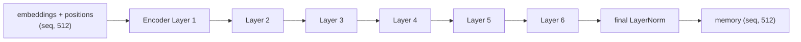

# 09 · The Encoder Stack

**Job:** read the whole source sentence and produce the **memory** — one
context-rich vector per source word — for the decoder to consult.

Code: [`model/encoder.py`](../annotated_transformer/model/encoder.py)
(`Encoder`, `EncoderLayer`).

---

## One encoder layer = 2 sub-blocks



```python
class EncoderLayer(nn.Module):
    def __init__(self, size, self_attn, feed_forward, dropout):
        self.self_attn = self_attn
        self.feed_forward = feed_forward
        self.sublayer = clones(SublayerConnection(size, dropout), 2)

    def forward(self, x, mask):
        x = self.sublayer[0](x, lambda x: self.self_attn(x, x, x, mask))
        return self.sublayer[1](x, self.feed_forward)
```

- **Sub-block 1 — self-attention.** Every source word looks at every other source
  word (only padding is masked). "hund" figures out it's the subject of "spielt".
- **Sub-block 2 — feed-forward.** Each word processes what it just learned,
  privately.

Both are wrapped in residual + pre-norm + dropout
([page 08](08-layernorm-residual-dropout.md)).

---

## The stack: 6 identical layers

```python
class Encoder(nn.Module):
    def __init__(self, layer, N):
        self.layers = clones(layer, N)      # N = 6 independent copies
        self.norm = LayerNorm(layer.size)   # one final norm (pre-norm design)

    def forward(self, x, mask):
        for layer in self.layers:
            x = layer(x, mask)
        return self.norm(x)
```



Each layer is a **separate set of weights** (`clones` deep-copies). Intuition for
what depth buys you: early layers pick up local/syntactic patterns, later layers
build phrase- and sentence-level meaning.

---

## Worked example — shapes for `ein hund spielt`

```
input ids                       (1, 3)          padded in real runs, ignore padding here
 → embeddings + positional       (1, 3, 512)
 → Encoder Layer 1               (1, 3, 512)
     self-attention: 'hund' now carries info from 'spielt'
     feed-forward:   each word reconsidered
 → ... Layers 2–6                (1, 3, 512)
 → final LayerNorm               (1, 3, 512)   ← this is `memory`
```

`memory[0]` ≈ meaning of "ein" in context, `memory[1]` ≈ "hund" in context,
`memory[2]` ≈ "spielt" in context.

Every decoder layer will attend into this `memory`
([page 10](10-decoder-stack.md)).

---

## What the encoder does *not* do

- It does **not** produce words. It only produces vectors.
- It has **no causal mask** — a source word is allowed to see the whole source
  sentence, past and future. Only the decoder is causal.

---

## Research background

- **Attention Is All You Need** §3.1 — <https://arxiv.org/abs/1706.03762>
- Encoder-only descendant: **BERT**, Devlin et al., 2018 —
  <https://arxiv.org/abs/1810.04805>
- What the layers learn: **BERT Rediscovers the Classical NLP Pipeline**,
  Tenney et al., 2019 — <https://arxiv.org/abs/1905.05950>

---

## In one sentence

The encoder is 6 stacked layers of (self-attention → feed-forward), each
residual-wrapped, turning the source word vectors into a context-aware `memory`
that the decoder reads from.

**Next:** [10 · The Decoder Stack →](10-decoder-stack.md)
