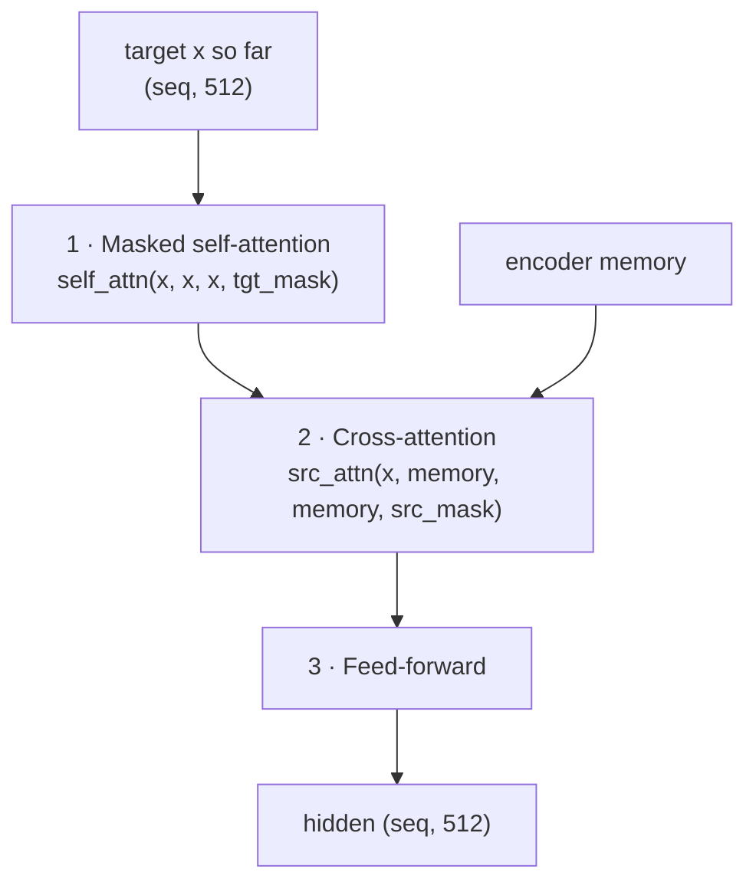
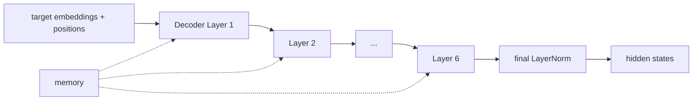
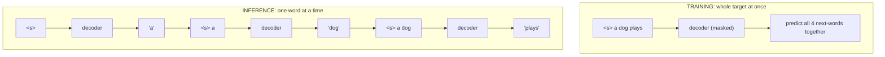

# 10 · The Decoder Stack

**Job:** given the encoder `memory` and the target words produced **so far**,
produce a hidden vector for the **next** word.

Code: [`model/decoder.py`](../annotated_transformer/model/decoder.py)
(`Decoder`, `DecoderLayer`).

---

## One decoder layer = 3 sub-blocks

The encoder layer had 2; the decoder inserts one extra in the middle to look at
the source.



```python
class DecoderLayer(nn.Module):
    def __init__(self, size, self_attn, src_attn, feed_forward, dropout):
        self.self_attn = self_attn      # sub-block 1
        self.src_attn = src_attn        # sub-block 2
        self.feed_forward = feed_forward# sub-block 3
        self.sublayer = clones(SublayerConnection(size, dropout), 3)

    def forward(self, x, memory, src_mask, tgt_mask):
        m = memory
        x = self.sublayer[0](x, lambda x: self.self_attn(x, x, x, tgt_mask))
        x = self.sublayer[1](x, lambda x: self.src_attn(x, m, m, src_mask))
        return self.sublayer[2](x, self.feed_forward)
```

| # | Sub-block | Q | K, V | Mask | In words |
|---|-----------|---|------|------|----------|
| 1 | masked self-attention | target | target | padding **+ causal** | "what have I written so far?" |
| 2 | cross-attention | target | **memory** | source padding | "which source words matter now?" |
| 3 | feed-forward | — | — | — | "think it over" |

The **causal mask** in sub-block 1 is what keeps generation honest — position `i`
can't see word `i+1`. See [page 02](02-batching-and-masking.md).

---

## The stack: 6 identical layers

```python
class Decoder(nn.Module):
    def __init__(self, layer, N):
        self.layers = clones(layer, N)      # 6 copies, own weights
        self.norm = LayerNorm(layer.size)   # final pre-norm

    def forward(self, x, memory, src_mask, tgt_mask):
        for layer in self.layers:
            x = layer(x, memory, src_mask, tgt_mask)
        return self.norm(x)
```



Every one of the 6 layers gets its own peek at the **same** `memory`.

---

## Worked example — one training step for `a dog plays`

Decoder **input** (`tgt`): `<s> a dog plays` → ids `[0, 4, 5, 6]` → embeddings
`(1, 4, 512)`.

```
Sub-block 1 (masked self-attention), row by row:
  <s>   can see: <s>
  a     can see: <s> a
  dog   can see: <s> a dog
  plays can see: <s> a dog plays

Sub-block 2 (cross-attention): each of the 4 positions looks into
  memory = [ein, hund, spielt].
  e.g. position 'dog' attends strongly to memory['hund'].

Sub-block 3 (feed-forward): per-position processing.

Output: hidden (1, 4, 512)
```

Then the [Generator](11-generator-and-full-model.md) turns each of those 4 hidden
vectors into a probability distribution over the English vocabulary:

| position sees | should predict |
|---|---|
| `<s>` | `a` |
| `a` | `dog` |
| `dog` | `plays` |
| `plays` | `</s>` |

All four predictions happen **in parallel** during training — that's the payoff of
the causal mask.

---

## Training (parallel) vs. inference (loop)



Same weights, same maths — the mask makes the training shortcut give the *same
result* as the slow loop would. Inference is covered on
[page 15](15-greedy-decoding.md).

---

## Research background

- **Attention Is All You Need** §3.1 — <https://arxiv.org/abs/1706.03762>
- Decoder-only descendants: **GPT-2**, Radford et al., 2019 —
  <https://cdn.openai.com/better-language-models/language_models_are_unsupervised_multitask_learners.pdf>
- Cross-attention analysis in NMT: **What does Attention in Neural Machine
  Translation Pay Attention to?**, Ghader & Monz, 2017 —
  <https://arxiv.org/abs/1710.03348>

---

## In one sentence

The decoder is 6 stacked layers of (masked self-attention → cross-attention into
the encoder memory → feed-forward); the causal mask lets it predict every
next-word in parallel during training while still behaving like a left-to-right
generator.

**Next:** [11 · Generator and the Full Model →](11-generator-and-full-model.md)
