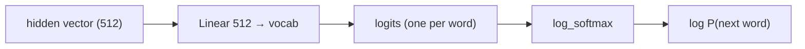
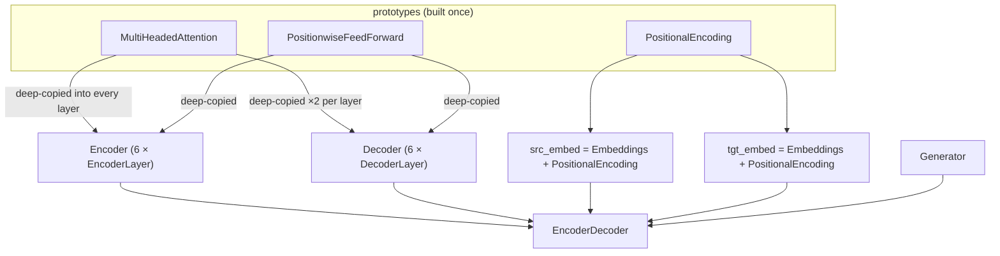

# 11 · The Generator and the Full Model

Two things on this page:

1. **Generator** — turn a decoder hidden vector into word probabilities.
2. **`make_model`** — how every piece from pages 03–10 is wired together.

Code: [`model/encoder_decoder.py`](../annotated_transformer/model/encoder_decoder.py)
(`EncoderDecoder`, `Generator`),
[`model/build.py`](../annotated_transformer/model/build.py) (`make_model`).

---

## The Generator

```python
class Generator(nn.Module):
    def __init__(self, d_model, vocab):
        self.proj = nn.Linear(d_model, vocab)   # 512 → vocab_size

    def forward(self, x):
        return log_softmax(self.proj(x), dim=-1)
```

Two steps:

1. **Linear `proj`**: `512 → vocab_size`. Produces one raw score ("logit") per
   word in the English vocabulary.
2. **`log_softmax`**: turn those scores into **log-probabilities** (numbers ≤ 0
   that, when exponentiated, sum to 1). Log form is used because the training
   loss ([page 12](12-label-smoothing.md)) expects log-probabilities and it's
   numerically safer.

### Worked example (tiny vocab of 7)

Decoder hidden vector for the position after "dog" → `proj` → logits:

```
word:    <s>   </s>  <blank> <unk>   a     dog   plays
logit:  -2.0  -1.0   -5.0    -3.0   0.5   1.0   4.0
```

`log_softmax` → log-probs → `exp` to read as probabilities:

```
prob:   0.002 0.006 0.0001  0.001  0.03  0.05  0.91
```

The model is 91% sure the next word is **"plays"**. 



---

## Why is it separate from the decoder?

During training we want to apply this projection **once** to the whole batch of
decoder outputs (all positions, all sentences) and hand the result to the loss.
Keeping `Generator` as its own module lets
[`SimpleLossCompute`](14-training-loop.md) call `model.generator(...)` exactly
where it needs to, and lets [greedy decode](15-greedy-decoding.md) call it on just
the last position.

---

## `EncoderDecoder` — the container

```python
class EncoderDecoder(nn.Module):
    def __init__(self, encoder, decoder, src_embed, tgt_embed, generator):
        ...
    def forward(self, src, tgt, src_mask, tgt_mask):
        return self.decode(self.encode(src, src_mask), src_mask, tgt, tgt_mask)
    def encode(self, src, src_mask):
        return self.encoder(self.src_embed(src), src_mask)
    def decode(self, memory, src_mask, tgt, tgt_mask):
        return self.decoder(self.tgt_embed(tgt), memory, src_mask, tgt_mask)
```

It holds five parts and defines the data flow. Note `encode` and `decode` are
**separate methods** — inference calls `encode` once and `decode` many times.

---

## `make_model` — the wiring diagram

```python
def make_model(src_vocab, tgt_vocab, N=6, d_model=512, d_ff=2048, h=8, dropout=0.1):
    c = copy.deepcopy
    attn     = MultiHeadedAttention(h, d_model)
    ff       = PositionwiseFeedForward(d_model, d_ff, dropout)
    position = PositionalEncoding(d_model, dropout)
    model = EncoderDecoder(
        Encoder(EncoderLayer(d_model, c(attn), c(ff), dropout), N),
        Decoder(DecoderLayer(d_model, c(attn), c(attn), c(ff), dropout), N),
        nn.Sequential(Embeddings(d_model, src_vocab), c(position)),
        nn.Sequential(Embeddings(d_model, tgt_vocab), c(position)),
        Generator(d_model, tgt_vocab),
    )
    for p in model.parameters():
        if p.dim() > 1:
            nn.init.xavier_uniform_(p)
    return model
```



### Two important details

- **`copy.deepcopy`** — every layer gets its **own** attention/FFN weights.
  Building one prototype and copying it is just a convenient way to write "give me
  6 fresh ones".
- **Xavier / Glorot init** — every weight matrix (`dim > 1`) is initialised so
  that the variance of activations stays roughly constant through the layers at
  the start of training. **Understanding the difficulty of training deep
  feedforward neural networks**, Glorot & Bengio, 2010 —
  <https://proceedings.mlr.press/v9/glorot10a.html>.

---

## End-to-end shape trace (`ein hund spielt` → `a dog plays`)

```
src ids           (1, 5)     0 4 5 6 1
tgt ids (input)   (1, 4)     0 4 5 6            (<s> a dog plays)
────────────────────────────────────────────────────────────────
src_embed(src)    (1, 5, 512)
encoder(...)      (1, 5, 512)   = memory
tgt_embed(tgt)    (1, 4, 512)
decoder(...)      (1, 4, 512)   = hidden
generator(hidden) (1, 4, vocab) = log-probs at each of the 4 positions
```

Compared against `tgt_y = a dog plays </s>` to get the loss.

---

## Weight tying (real models, optional here)

The paper **shares one matrix** between: the source embedding, the target
embedding, and the generator's `proj`. Fewer parameters, better results.
This repo leaves them separate for clarity but shows the hook in the notebook.

- **Using the Output Embedding to Improve Language Models**, Press & Wolf, 2017 —
  <https://arxiv.org/abs/1608.05859>

---

## In one sentence

The `Generator` is a `Linear + log_softmax` that turns each decoder hidden vector
into next-word log-probabilities; `make_model` builds one attention/FFN/position
prototype and deep-copies it into 6 encoder + 6 decoder layers, wraps everything
in `EncoderDecoder`, and Xavier-initialises the weights.

**Next:** [12 · Label Smoothing →](12-label-smoothing.md)
