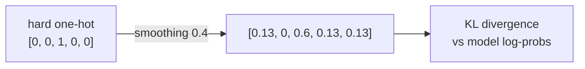

# 12 · Label Smoothing

**Job:** soften the training target so the model doesn't become dangerously
over-confident.

Code: [`training/label_smoothing.py`](../annotated_transformer/training/label_smoothing.py)
(`LabelSmoothing`).

---

## The problem with a "hard" target

Normally we tell the model: "the next word is `plays`, probability **1.0**;
everything else **0.0**". To push a softmax output to exactly 1.0 the logit must go
to **+∞**. The model chases ever-larger weights, overfits, and becomes brittle —
it's 99.999% sure even when it's wrong.

## The fix

Give the correct word probability `confidence = 1 − smoothing` (here
`1 − 0.1 = 0.9`) and spread the remaining `0.1` **evenly** over the other words.

```python
class LabelSmoothing(nn.Module):
    def __init__(self, size, padding_idx, smoothing=0.0):
        self.criterion = nn.KLDivLoss(reduction="sum")
        self.confidence = 1.0 - smoothing
        self.smoothing = smoothing
        ...
    def forward(self, x, target):
        true_dist = x.data.clone()
        true_dist.fill_(self.smoothing / (self.size - 2))     # spread the 0.1
        true_dist.scatter_(1, target.data.unsqueeze(1), self.confidence)  # 0.9 on the answer
        true_dist[:, self.padding_idx] = 0                    # never target padding
        ...
        return self.criterion(x, true_dist)                  # KL divergence
```

`size - 2` because two slots get no smoothing mass: the correct word (it gets
0.9) and the padding token (it gets 0).

---

## Worked example — vocab of 5, target = word 2, smoothing = 0.4

(0.4 is exaggerated for visibility; real training uses 0.1.)

```
                <s>   pad   a     dog   plays
hard target:    0     0     0     1.0   0        ← "definitely 'dog'"  (index 3 here)
```

With `smoothing = 0.4`, `padding_idx = 0`, target index = 2:

```
spread = 0.4 / (5 - 2) = 0.133
                <s>    pad    w2      w3     w4
smoothed:       0.133   0     0.6     0.133  0.133
                ↑              ↑
        padding always 0   correct word = 1 - 0.4 = 0.6
```

The model is now trained to output "mostly w2, but keep a little mass elsewhere".



---

## Loss used: KL divergence

`nn.KLDivLoss` measures how far the model's predicted distribution is from this
smoothed target distribution. It expects the model output already in
**log-space** — which is exactly what the [Generator](11-generator-and-full-model.md)
produces (`log_softmax`).

---

## The trade-off

| | perplexity | accuracy / BLEU |
|---|---|---|
| hard targets | better | worse |
| label smoothing | **worse** | **better** |

The paper accepts worse perplexity because the model "learns to be more unsure",
which generalises better and improves the final BLEU score.

The repo's visualization
[`penalization_visualization`](../annotated_transformer/viz/label_smoothing.py)
shows that once the model gets *very* confident about a word, label smoothing
actually **increases** the loss — actively discouraging over-confidence.

---

## Research background

- Introduced in **Rethinking the Inception Architecture for Computer Vision**,
  Szegedy et al., 2015 (§7) — <https://arxiv.org/abs/1512.00567>
- **When Does Label Smoothing Help?**, Müller, Kornblith & Hinton, 2019 —
  <https://arxiv.org/abs/1906.02629>
- **Attention Is All You Need** §5.4 — <https://arxiv.org/abs/1706.03762>

---

## In one sentence

Instead of training toward "100% this word, 0% everything else", label smoothing
trains toward "90% this word, 10% spread thin" — which hurts perplexity a little
but makes the model calibrated and improves translation quality.

**Next:** [13 · Optimizer and Learning-Rate Schedule →](13-optimizer-and-lr-schedule.md)
