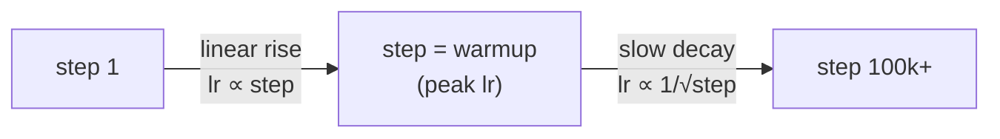

# 13 · Optimizer and Learning-Rate Schedule

**Job:** decide how big a step to take when updating the weights — and change that
step size over the course of training.

Code: [`training/schedule.py`](../annotated_transformer/training/schedule.py)
(`rate`). The optimizer itself is plain `torch.optim.Adam`.

---

## The optimizer: Adam

```python
torch.optim.Adam(model.parameters(), lr=..., betas=(0.9, 0.98), eps=1e-9)
```

Adam adapts the step size **per parameter** using running averages of the
gradient (`β₁ = 0.9`) and the squared gradient (`β₂ = 0.98`). The `0.98` (vs. the
usual `0.999`) makes it react a bit faster — helpful with the schedule below.

- **Adam: A Method for Stochastic Optimization**, Kingma & Ba, 2014 —
  <https://arxiv.org/abs/1412.6980>

---

## The schedule: warmup, then decay

The learning rate is **not constant**. It follows the "Noam" schedule:

```
lr = factor · d_model^(-0.5) · min( step^(-0.5),  step · warmup^(-1.5) )
```

```python
def rate(step, model_size, factor, warmup):
    if step == 0:
        step = 1
    return factor * (model_size ** (-0.5)
                     * min(step ** (-0.5), step * warmup ** (-1.5)))
```

Two phases, and `min(...)` picks whichever applies:



- **Warmup (steps 0 → 4000):** `step · warmup^(-1.5)` is smaller, so lr rises
  **linearly** from ~0.
- **After warmup:** `step^(-0.5)` is smaller, so lr **decays** as `1/√step`.

### Shape of the curve

```
lr
 │        ╭─╮
 │       ╱   ╲___
 │      ╱        ‾‾‾───____
 │     ╱                   ‾‾‾‾────________
 │    ╱
 └───┴──────────────────────────────────────► step
     0   4000 (warmup)                    100k
```

---

## Why warmup?

At step 0 the weights are random and the Adam variance estimates are unreliable.
A big learning rate now would send the model somewhere terrible and it might never
recover. So we **tiptoe** for the first few thousand steps, then speed up once the
estimates have settled, then gradually slow down to fine-tune.

(The pre-norm variant this repo uses — [page 08](08-layernorm-residual-dropout.md)
— is more forgiving and can sometimes skip warmup. Post-norm, as in the paper,
really needs it.)

- **On Layer Normalization in the Transformer Architecture**, Xiong et al., 2020 —
  <https://arxiv.org/abs/2002.04745>
- **Adam Can Converge Without Modifications on Update Rules**, and the earlier
  **On the adequacy of untuned warmup for adaptive optimization** (RAdam), Liu et
  al., 2019 — <https://arxiv.org/abs/1908.03265>

---

## Worked example (`d_model = 512`, `factor = 1`, `warmup = 4000`)

```
step      formula picks              lr
   1      1 · 4000^-1.5              ≈ 6.9e-7      (basically zero — tiptoe)
 1000     1000 · 4000^-1.5           ≈ 6.9e-4
 4000     4000 · 4000^-1.5           ≈ 6.9e-4      ← peak (both terms equal)
16000     16000^-0.5                 ≈ 3.5e-4      (decaying)
100000    100000^-0.5                ≈ 1.4e-4
```

`d_model^(-0.5) = 512^(-0.5) ≈ 0.044` multiplies all of the above.

---

## How it's plugged in

```python
lr_scheduler = LambdaLR(
    optimizer=optimizer,
    lr_lambda=lambda step: rate(step, d_model, factor=1, warmup=config["warmup"]),
)
```

`LambdaLR` calls our `rate(step)` after every `optimizer.step()` and sets the
learning rate accordingly. See the training loop on
[page 14](14-training-loop.md). You can plot all of this with
`python scripts/visualize.py schedule`.

---

## Research background

- **Attention Is All You Need** §5.3 — <https://arxiv.org/abs/1706.03762>
- Later, simpler alternatives: **cosine decay** (**SGDR**, Loshchilov & Hutter,
  2016 — <https://arxiv.org/abs/1608.03983>), and **AdamW** (decoupled weight
  decay, Loshchilov & Hutter, 2017 — <https://arxiv.org/abs/1711.05101>)

---

## In one sentence

Train with Adam, but ramp the learning rate up linearly for the first ~4000 steps
(so the random early model isn't blown apart) and then decay it as `1/√step`.

**Next:** [14 · The Training Loop →](14-training-loop.md)
