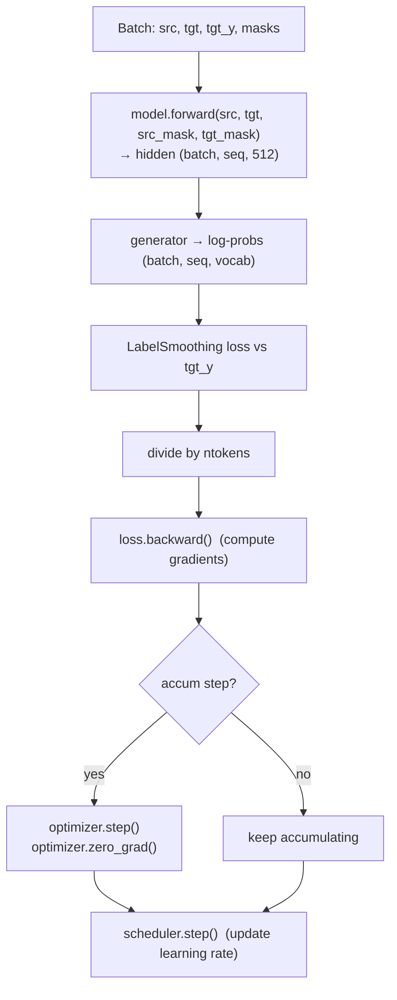
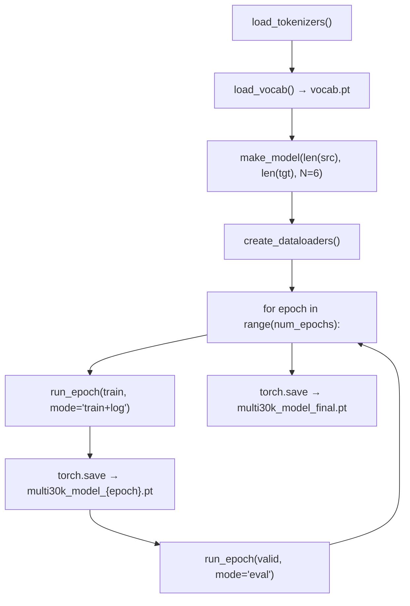

# 14 · The Training Loop

**Job:** repeatedly — feed a batch through the model, measure how wrong it is,
nudge the weights to be less wrong.

Code: [`training/loop.py`](../annotated_transformer/training/loop.py) (`run_epoch`),
[`training/loss.py`](../annotated_transformer/training/loss.py)
(`SimpleLossCompute`),
[`training/state.py`](../annotated_transformer/training/state.py) (`TrainState`),
[`training/trainer.py`](../annotated_transformer/training/trainer.py)
(the full Multi30k run).

---

## One training step



---

## `SimpleLossCompute` — the loss glue

```python
class SimpleLossCompute:
    def __init__(self, generator, criterion):
        self.generator = generator      # Linear + log_softmax
        self.criterion = criterion      # LabelSmoothing

    def __call__(self, x, y, norm):
        x = self.generator(x)
        sloss = self.criterion(
            x.contiguous().view(-1, x.size(-1)),   # (batch·seq, vocab)
            y.contiguous().view(-1),               # (batch·seq,)
        ) / norm
        return sloss.data * norm, sloss
```

- Flattens batch and sequence dims together so the criterion sees a plain list of
  predictions vs. a plain list of correct ids.
- Divides by `norm` (= `batch.ntokens`, the count of real target tokens) so the
  gradient size doesn't depend on how much padding the batch had.
- Returns `(loss_for_the_running_total, loss_tensor_to_backprop)`.

---

## `run_epoch` — one pass over the data

```python
for i, batch in enumerate(data_iter):
    out = model.forward(batch.src, batch.tgt, batch.src_mask, batch.tgt_mask)
    loss, loss_node = loss_compute(out, batch.tgt_y, batch.ntokens)
    if mode == "train" or mode == "train+log":
        loss_node.backward()                     # accumulate gradients
        train_state.step += 1
        train_state.samples += batch.src.shape[0]
        train_state.tokens += batch.ntokens
        if i % accum_iter == 0:
            optimizer.step()                     # apply the update
            optimizer.zero_grad(set_to_none=True)
            train_state.accum_step += 1
        scheduler.step()                         # move the LR schedule
    total_loss += loss
    total_tokens += batch.ntokens
    ...
return total_loss / total_tokens, train_state
```

### Gradient accumulation

Calling `.backward()` **adds** to the existing gradients. So we can run
`accum_iter` batches, letting gradients pile up, and only then call
`optimizer.step()`. Effect: an **effective batch size** of `accum_iter ×
batch_size` without needing the memory for one giant batch. The paper's batches
hold ~25000 tokens; on small hardware you reach that by accumulating.

### `mode`

| mode | backward + step? | prints progress? |
|------|------------------|------------------|
| `"train"` | yes | no |
| `"train+log"` | yes | yes (every 40 batches) |
| `"eval"` | no (pass `DummyOptimizer`/`DummyScheduler`) | no |

`DummyOptimizer` / `DummyScheduler`
([`utils.py`](../annotated_transformer/utils.py)) are no-ops so the **same loop
code** works for validation.

---

## `TrainState` — just counters

```python
@dataclass
class TrainState:
    step: int = 0         # optimizer steps this epoch
    accum_step: int = 0   # accumulation steps
    samples: int = 0      # sentences seen
    tokens: int = 0       # target tokens seen
```

Used only for logging.

---

## The full Multi30k run (`trainer.py`)



Config (plain dict, from `default_config()`):

```python
{"batch_size": 32, "distributed": False, "num_epochs": 8, "accum_iter": 10,
 "base_lr": 1.0, "max_padding": 72, "warmup": 3000, "file_prefix": "multi30k_model_"}
```

Run it: `python scripts/train_multi30k.py`. (Slow on CPU; the multi-GPU
`distributed` path needs Linux + NCCL — see the note in `trainer.py`.)

---

## Worked example — reading a log line

```
Epoch Step:     41 | Accumulation Step:   4 | Loss:   6.94 | Tokens / Sec:  1234.5 | Learning Rate: 3.1e-05
```

- batch 41 of this epoch
- 4 optimizer updates so far (41 / accum_iter=10, roughly)
- average loss ≈ 6.94 per token — near `ln(vocab_size)`, i.e. the model is still
  near random; this should fall over the epochs
- ~1234 target tokens/sec throughput
- current LR from the schedule ([page 13](13-optimizer-and-lr-schedule.md))

---

## Research background

- **Attention Is All You Need** §5.1–5.3 — <https://arxiv.org/abs/1706.03762>
- Gradient accumulation / large-batch training: **Accurate, Large Minibatch SGD**,
  Goyal et al., 2017 — <https://arxiv.org/abs/1706.02677>
- **Scaling Laws for Neural Language Models**, Kaplan et al., 2020 — how loss
  falls with compute/data/size — <https://arxiv.org/abs/2001.08361>

---

## In one sentence

`run_epoch` walks the data once: forward pass → label-smoothed loss ÷ token count
→ `backward()` → every `accum_iter` batches do `optimizer.step()` and always
`scheduler.step()`; the same function runs validation with no-op optimizer/scheduler.

**Next:** [15 · Greedy Decoding →](15-greedy-decoding.md)
