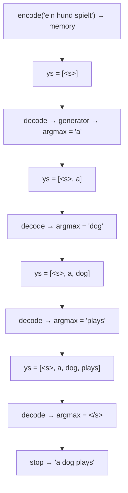

# 15 · Greedy Decoding

**Job:** use the trained model to actually translate — produce the English
sentence one word at a time.

Code: [`inference/decode.py`](../annotated_transformer/inference/decode.py)
(`greedy_decode`),
[`inference/translate.py`](../annotated_transformer/inference/translate.py)
(`check_outputs`, `run_model_example`).

---

## Why a loop now?

In training we had the correct target and fed it all at once
([page 10](10-decoder-stack.md)). At inference we **don't know the answer** — each
word depends on the words chosen before it. So we loop.

**"Greedy"** = at every step just take the single highest-probability word. No
looking ahead, no alternatives kept.

```python
def greedy_decode(model, src, src_mask, max_len, start_symbol):
    memory = model.encode(src, src_mask)                 # encode source ONCE
    ys = torch.zeros(1, 1).fill_(start_symbol).type_as(src.data)   # start with <s>
    for _ in range(max_len - 1):
        out = model.decode(
            memory, src_mask, ys,
            subsequent_mask(ys.size(1)).type_as(src.data),
        )
        prob = model.generator(out[:, -1])              # look only at the LAST position
        _, next_word = torch.max(prob, dim=1)           # pick the argmax
        next_word = next_word.data[0]
        ys = torch.cat([ys, torch.zeros(1, 1).type_as(src.data).fill_(next_word)], dim=1)
    return ys
```

---

## Step-by-step on our example

Source `ein hund spielt` → `memory` (computed once, reused every step).



| step | decoder input `ys` | model's top next-word | new `ys` |
|------|--------------------|------------------------|----------|
| 1 | `<s>` | `a` (p=0.88) | `<s> a` |
| 2 | `<s> a` | `dog` (p=0.79) | `<s> a dog` |
| 3 | `<s> a dog` | `plays` (p=0.91) | `<s> a dog plays` |
| 4 | `<s> a dog plays` | `</s>` (p=0.85) | `<s> a dog plays </s>` |

Strip `<s>` / `</s>` → **"a dog plays"**.

Notice each step re-runs the decoder over the **whole** `ys` so far, but we only
read `out[:, -1]` — the prediction for the position after the last token. (Real
systems cache the earlier computations; this simple version recomputes.)

---

## `check_outputs` — batch translation with printout

[`check_outputs`](../annotated_transformer/inference/translate.py) runs
`greedy_decode` on the first N validation sentences and prints:

```
Example 0 ========
Source Text (Input)        : <s> Ein Mann mit einem orangefarbenen Hut ... </s>
Target Text (Ground Truth) : <s> A man in an orange hat ... </s>
Model Output               : <s> A man in an orange hat starring at something . </s>
```

It returns the decoded batches so
[`viz/attention.py`](../annotated_transformer/viz/attention.py) can reuse them.

Run it: `python scripts/translate.py --examples 5` (needs
`multi30k_model_final.pt`).

---

## Greedy is the simplest — not the best

Greedy can paint itself into a corner: a slightly-wrong first word forces bad
later words. Better search strategies keep several candidates alive:

- **Beam search** — keep the top `k` partial sentences at every step, expand all,
  re-prune to `k`. Standard in NMT. See **Sequence to Sequence Learning with
  Neural Networks**, Sutskever et al., 2014 — <https://arxiv.org/abs/1409.3215>,
  and GNMT — <https://arxiv.org/abs/1609.08144>.
- **Sampling / top-k / nucleus (top-p)** — for open-ended generation.
  **The Curious Case of Neural Text Degeneration**, Holtzman et al., 2019 —
  <https://arxiv.org/abs/1904.09751>.

The paper also **averages the last few checkpoints** into one model before
decoding (`average()` in
[`trainer.py`](../annotated_transformer/training/trainer.py)) — a cheap ensemble.

---

## Research background

- **Attention Is All You Need** §6.1 (beam size 4, length penalty 0.6) —
  <https://arxiv.org/abs/1706.03762>
- **On NMT Search Errors and Model Errors**, Stahlberg & Byrne, 2019 — the
  surprising finding that the true argmax is often the empty string —
  <https://arxiv.org/abs/1908.10090>

---

## In one sentence

Encode the source once, then loop: feed the words chosen so far into the decoder,
take the single most-probable next word, append it, repeat until `</s>`.

**Next:** [16 · Attention Visualization →](16-attention-visualization.md)
