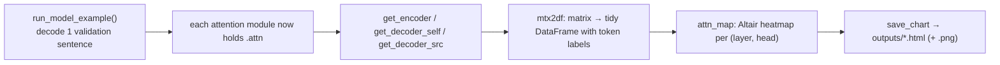

# 16 · Attention Visualization

**Job:** look inside a trained model and see **which words attended to which**.

Code: [`viz/attention.py`](../annotated_transformer/viz/attention.py),
run with `python scripts/visualize.py attention`.

---

## Where the numbers come from

Every [`MultiHeadedAttention`](../annotated_transformer/model/attention.py) module
stashes its last weight matrix on `self.attn` after a forward pass:

```python
x, self.attn = attention(query, key, value, mask=mask, dropout=self.dropout)
```

Shape: `(batch, heads, seq_q, seq_k)`. Entry `[0, h, i, j]` = "in head `h`, how
much did query word `i` attend to key word `j`" (each row sums to 1).

The getters just reach in and grab them:

```python
def get_encoder(model, layer):     return model.encoder.layers[layer].self_attn.attn
def get_decoder_self(model, layer):return model.decoder.layers[layer].self_attn.attn
def get_decoder_src(model, layer): return model.decoder.layers[layer].src_attn.attn
```



---

## Reading a heatmap

Each chart is one `(layer, head)`. Rows = query words, columns = key words,
colour = weight (bright = strong attention).

```
                 key: <s>  A   man  in  orange  hat
   query: man  [        .   .8   .1   .   .      .   ]   ← "man" attends to "A"
   query: hat  [        .   .1   .1   .   .6     .1  ]   ← "hat" attends to "orange"
```

### The three views

| Function | What it shows | Typical pattern |
|----------|---------------|-----------------|
| `encoder_self` | source words attending to source words | heads specialise: adjacent-word heads, verb→subject heads, a "rest on `<s>`" head |
| `decoder_self` | output words attending to earlier output words | strictly lower-triangular (the causal mask), often a strong diagonal / previous-word focus |
| `decoder_src` | output words attending to **source** words (cross-attention) | the **soft alignment** — "cat" lights up under "Katze". This is the closest thing to a word-to-word translation dictionary the model has. |

`get_all_attention_charts` decodes one example and builds all three (encoder
self-attention for layers 1/3/5, both decoder views for all six layers — matching
the notebook).

---

## Worked example — the causal mask, made visible

Decoder self-attention for target `<s> a dog plays` will always look like this
(zeros in the upper triangle, because [page 02](02-batching-and-masking.md)):

```
            <s>    a     dog   plays
   <s>   [ 1.00  0.00  0.00  0.00 ]
   a     [ 0.62  0.38  0.00  0.00 ]
   dog   [ 0.30  0.25  0.45  0.00 ]
   plays [ 0.20  0.15  0.25  0.40 ]
```

Every row sums to 1, and no word can attend to its right. Seeing this staircase in
the rendered chart is a good sanity check that masking works.

---

## Why bother?

- **Debugging** — if `decoder_src` is diffuse noise, the model hasn't learned to
  align; if `decoder_self` has mass in the upper triangle, your mask is broken.
- **Interpretability** — attention is a (partial, contested) window into model
  reasoning.

A caveat worth knowing: attention weights are **not** a full explanation of a
model's output.

- **Attention is not Explanation**, Jain & Wallace, 2019 —
  <https://arxiv.org/abs/1902.10186>
- **Attention is not not Explanation**, Wiegreffe & Pinter, 2019 —
  <https://arxiv.org/abs/1908.04626>

---

## Research background

- **Attention Is All You Need** — the attention-visualisation figures in the
  appendix — <https://arxiv.org/abs/1706.03762>
- **A Multiscale Visualization of Attention in the Transformer Model** (BertViz),
  Vig, 2019 — <https://arxiv.org/abs/1906.05714>
- **What Does BERT Look At? An Analysis of BERT's Attention**, Clark et al., 2019
  — <https://arxiv.org/abs/1906.04341>

---

## In one sentence

After decoding a sentence, each attention layer still holds its weight matrix;
these scripts pull those out and draw heatmaps so you can literally see the
causal staircase in the decoder and the source↔target word alignment in
cross-attention.

**Next:** [17 · Papers and Glossary →](17-papers-and-glossary.md)
