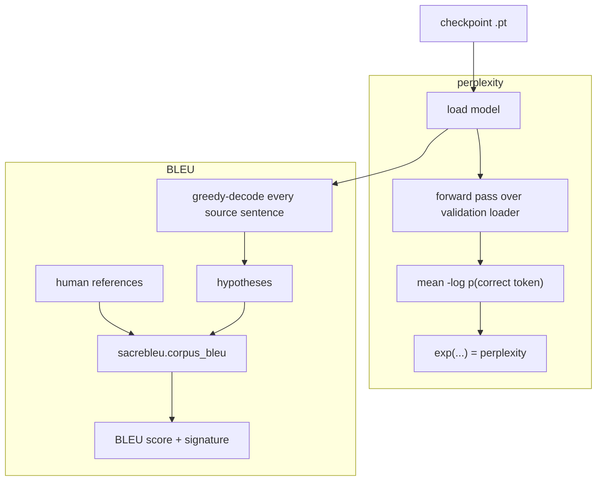

# 18 · Evaluation — BLEU and Perplexity

The original notebook only ever printed the **validation loss**. That tells you
training is progressing, but not *how good the translations are*. This page
covers the two numbers we added, and how to read them.

Code: [`evaluation/perplexity.py`](../annotated_transformer/evaluation/perplexity.py),
[`evaluation/bleu.py`](../annotated_transformer/evaluation/bleu.py).

---

## Perplexity — "how surprised is the model?"

**Perplexity = `exp(average negative log-likelihood per token)`.**

For each target token the model outputs a probability. Take the probability it
gave the **correct** next word, average `-log(p)` over every token, exponentiate.

```python
# evaluation/perplexity.py, core line
nll = F.nll_loss(log_probs.reshape(-1, V), tgt_y.reshape(-1),
                 ignore_index=pad_idx, reduction="sum")
perplexity = math.exp(total_nll / total_tokens)
```

### How to read it

| Perplexity | Meaning |
|-----------|---------|
| = `V` (vocab size) | model is guessing uniformly at random — knows nothing |
| 100 | on average as unsure as if choosing between 100 equally-likely words |
| 20 | ~between 20 words |
| 1.0 | perfect — always certain of the right word |

**Lower is better.** For Multi30k DE→EN a small trained Transformer lands roughly
in the single digits to low tens depending on training length.

### Worked example

Model predicts these probabilities for the correct words of `a dog plays </s>`:

```
token:   a      dog    plays  </s>
p(correct): 0.5   0.25   0.5    0.8
-log(p):  0.69   1.39   0.69   0.22
```

```
mean NLL   = (0.69 + 1.39 + 0.69 + 0.22) / 4 = 0.7475
perplexity = exp(0.7475) ≈ 2.11
```

The model is about as unsure as flipping between ~2 words per position.

### Why not just use the training loss?

The training criterion is
[`LabelSmoothing`](../annotated_transformer/training/label_smoothing.py) — KL
divergence against a *smoothed* target ([page 12](12-label-smoothing.md)). That
number is inflated on purpose and isn't comparable to perplexities reported
elsewhere. `corpus_perplexity` recomputes the **plain** cross-entropy, so the
value means what people expect.

### Token accuracy (bonus)

`corpus_perplexity` also returns **token accuracy**: of all the non-padding
target tokens, what fraction did the model's top guess get exactly right? It is a
blunt metric for translation (many words have several valid choices) but it is
intuitive and rises steadily during training, so it's a nice live signal.

### KL "overlap" snapshot

[`target_vs_prediction`](../annotated_transformer/evaluation/distributions.py)
takes one fixed target position and lines up two distributions over the
vocabulary:

* the **model's** predicted next-token probabilities, and
* the **smoothed target** the criterion is pulling toward (0.9 on the true word,
  the rest spread thin — [page 12](12-label-smoothing.md)).

It reports `KL(target ‖ model)` over the full vocabulary. Early in training the
model is spread out and the KL is large; as it learns, the model's bar for the
true word climbs toward 0.9 and the KL falls. The live dashboard draws these two
bar sets on top of each other so you can watch them converge.

---

## BLEU — "how much does the output look like the reference?"

**BLEU** (BiLingual Evaluation Understudy) compares the model's translation to a
human reference by counting **overlapping word n-grams** (1-grams, 2-grams,
3-grams, 4-grams), with a penalty for being too short.

Score runs **0 → 100**. Higher is better. Rough guide for MT:

| BLEU | Quality |
|------|---------|
| < 10 | almost useless |
| 10–20 | gist only, broken |
| 20–30 | understandable, clearly non-native |
| 30–40 | good |
| 40+ | very good / near human on easy domains |

Multi30k is short image captions (easy), so decent models score in the 30s.

### Worked example

```
reference:     a small dog is playing in the snow
model output:  a small dog plays in the snow
```

- **1-grams:** output has 7 words; "a small dog in the snow" (6) appear in the
  reference → 6/7 precision.
- **2-grams:** "a small", "small dog", "in the", "the snow" match (4);
  "dog plays", "plays in" don't → 4/6.
- 3-grams and 4-grams: partial.
- **Brevity penalty:** output (7) is shorter than reference (8) → small penalty.

BLEU multiplies the n-gram precisions (geometrically) and applies the penalty →
one number around the high-30s / low-40s here.

### How we compute it

```python
# evaluation/bleu.py
hyps = [translate_sentence(model, de_text, ...) for de_text, _ in pairs]  # greedy decode
refs = [en_text for _, en_text in pairs]
score = sacrebleu.corpus_bleu(hyps, [refs]).score
```

We use **`sacrebleu`** rather than a hand-rolled BLEU because plain BLEU depends
on tokenization, lowercasing, etc., and papers were quietly reporting
non-comparable numbers for years. sacrebleu fixes the tokenization and prints a
**signature** string so a score is reproducible.

- **A Call for Clarity in Reporting BLEU Scores**, Post, 2018 —
  <https://arxiv.org/abs/1804.08771>
- **BLEU: a Method for Automatic Evaluation of Machine Translation**, Papineni et
  al., 2002 — <https://aclanthology.org/P02-1040/>

### BLEU's limits

It only rewards surface word overlap — a perfect paraphrase with different words
scores low. Modern work also uses embedding-based metrics:

- **BERTScore**, Zhang et al., 2019 — <https://arxiv.org/abs/1904.09675>
- **COMET**, Rei et al., 2020 — <https://arxiv.org/abs/2009.09025>

For comparing *the same model at 10 vs 20 vs 30 epochs*, BLEU is fine — the
comparison is internally consistent.

---

## The pipeline



---

## Where the numbers land

`scripts/run_experiments.py` logs, per epoch, to `results/metrics.json`:

```json
{"epoch": 10, "train_loss": 3.9, "val_loss": 4.2,
 "val_perplexity": 12.7, "bleu_valid": 31.4, "bleu_test": 30.1}
```

and `scripts/evaluate.py` prints the same for any single checkpoint. See
[page 19](19-running-experiments.md) for running it.

---

## In one sentence

**Perplexity** measures how confident the model is about the *reference* words
(lower = better, computed with plain cross-entropy); **BLEU** measures how much
the model's actual *generated* translation overlaps the reference (higher =
better, computed with sacrebleu for reproducibility).

**Next:** [19 · Running the Experiments →](19-running-experiments.md)
