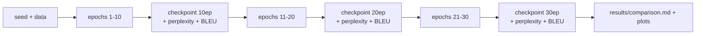

# 19 · Running the Experiments

How to train the German→English model, on a GPU **or** on a CPU-only machine, and
reproduce the 10 / 20 / 30-epoch comparison in `results/`.

Code: [`scripts/run_experiments.py`](../scripts/run_experiments.py),
[`scripts/evaluate.py`](../scripts/evaluate.py),
[`scripts/plot_results.py`](../scripts/plot_results.py).

---

## What the experiment is

Train **once for 30 epochs**. Save a checkpoint at epoch 10, 20 and 30, and at
each of those points measure validation loss, perplexity, and BLEU
([page 18](18-evaluation-bleu-and-perplexity.md)) on both the validation and test
splits.

> **Why one run and not three?** The learning-rate schedule
> ([page 13](13-optimizer-and-lr-schedule.md)) depends only on the **step
> number** — warmup is a fixed 3000 steps, decay is `1/√step`. Nothing depends on
> the *total* number of epochs. So the first 10 epochs of a 30-epoch run are
> bit-for-bit identical to a standalone 10-epoch run (same seed). One run,
> checkpointed three times = the same comparison at a third of the cost.



---

## Path A — GPU (recommended)

Needs an NVIDIA GPU with ≥ 4 GB. The model uses < 2 GB at batch size 32.

### 1. Install (into your virtualenv)

```bash
# CUDA build of PyTorch — pick the index that matches your driver:
#   driver >= 560 -> cu126     driver >= 570 -> cu128
uv pip install torch --index-url https://download.pytorch.org/whl/cu126
uv pip install -r requirements.txt
python -m spacy download de_core_news_sm en_core_web_sm
```

Check the GPU is visible:
```bash
python -c "import torch; print(torch.cuda.is_available(), torch.cuda.get_device_name(0))"
```

### 2. Run

```bash
python scripts/run_experiments.py --epochs 30
```

**Time:** ~2–3 min/epoch + ~10–15 min BLEU at each checkpoint ≈ **1.5–2.5 hours**
on a 6 GB card. Progress prints every 40 batches and after every epoch;
`results/metrics.json` is rewritten each epoch.

### 3. Watch it live

Open **`results/live.html`** in a browser (no server — it uses a meta-refresh
every 10 s). It shows: a progress bar + ETA, the latest live loss line, curves
for train/val loss, **token accuracy**, perplexity and **KL(target ‖ model)**, an
overlapping **prediction-vs-target bar chart** (blue = model, green = smoothed
target — they converge as it learns), and **BLEU + perplexity cards** filled in
at each checkpoint. Or `tail -f results/train.log`.

### 4. Results appear in `results/`

```
results/
├── live.html                        auto-refreshing dashboard (during the run)
├── train.log                        full timestamped log
├── metrics.json                     every epoch's numbers (loss, ppl, accuracy, KL, BLEU)
├── comparison.md                    ← the summary table + plots + commentary
├── experiment-10-epochs.md          per-checkpoint detail + samples
├── experiment-20-epochs.md
├── experiment-30-epochs.md
├── sample_translations.md           same sentences, 10 vs 20 vs 30 side by side
├── checkpoints/multi30k_de_en_{10,20,30}ep.pt
└── plots/{loss_curve,perplexity_curve,accuracy_kl_curve,bleu_bars,distribution_snapshot}.png
```

---

## Path B — CPU only (no GPU)

The **full** base model (`d_model=512`, 6+6 layers, ~40M params) is impractical on
CPU: roughly **1–2 hours per epoch** on an 8-core desktop → 30–60 hours for 30
epochs. Don't.

Instead, train a **smaller model** that still demonstrates the whole pipeline:

```bash
uv pip install torch                          # plain CPU build is fine
uv pip install -r requirements.txt
python -m spacy download de_core_news_sm en_core_web_sm

python scripts/run_experiments.py \
    --epochs 10 --checkpoint-epochs 3 6 10 \
    --n-layers 2 --d-model 128 --d-ff 512 --heads 4 \
    --batch-size 16 --warmup 400
```

| Setting | Base (GPU) | CPU-scale |
|---------|-----------:|----------:|
| layers (`--n-layers`) | 6 | 2 |
| width (`--d-model`) | 512 | 128 |
| FFN (`--d-ff`) | 2048 | 512 |
| heads (`--heads`) | 8 | 4 |
| params | ~40M | ~4M |
| time/epoch (8-core CPU) | ~1–2 h | ~5–15 min |

Expect **lower BLEU** (smaller model, fewer epochs) — the point is that the
machinery runs and the metrics move in the right direction. To just sanity-check
the code end to end in a minute, add `--max-bleu-sentences 50`.

You can also skip translation entirely and run the toy copy task, which is CPU-
friendly by design:
```bash
python scripts/train_copy.py --epochs 20
```

---

## Memory — will it fit?

| | GPU run | CPU run (base) | CPU run (scaled) |
|---|---|---|---|
| GPU VRAM | ~1.5–2 GB | — | — |
| System RAM (process) | ~2–3 GB | ~3–5 GB | ~1–2 GB |
| Disk (3 checkpoints) | ~0.5 GB | ~0.5 GB | ~50 MB |

The dataset itself is tiny (~29k short sentence pairs). The main risk is having
too little **free** RAM because other apps are open — close them before a CPU
run. Batch size is the knob if you ever do hit a limit (`--batch-size`).

---

## Evaluating a checkpoint later

The saved `.pt` files are just weights. Re-score any of them:

```bash
python scripts/evaluate.py results/checkpoints/multi30k_de_en_30ep.pt
# add --cpu to force CPU; match --n-layers/--d-model to how it was trained
```

Or translate one sentence in Python:

```python
import torch
from annotated_transformer.data.tokenizer import load_tokenizers
from annotated_transformer.data.vocab import load_vocab
from annotated_transformer.model import make_model
from annotated_transformer.inference import translate_sentence

spacy_de, spacy_en = load_tokenizers()
vocab_src, vocab_tgt = load_vocab(spacy_de, spacy_en)
model = make_model(len(vocab_src), len(vocab_tgt), N=6)
model.load_state_dict(torch.load("results/checkpoints/multi30k_de_en_30ep.pt",
                                 map_location="cpu", weights_only=True))
print(translate_sentence(model, "Ein Hund spielt im Schnee.",
                         vocab_src, vocab_tgt, spacy_de, torch.device("cpu")))
```

---

## Regenerating just the reports

If a run finished (or crashed) and you have `results/metrics.json`:

```bash
python scripts/plot_results.py
```

---

## In one sentence

`python scripts/run_experiments.py --epochs 30` trains once, checkpoints at
10/20/30, and drops a full comparison (tables, plots, sample translations) into
`results/`; CPU users pass `--n-layers 2 --d-model 128 --d-ff 512` to make it
tractable.

← Back to the [docs index](README.md)
