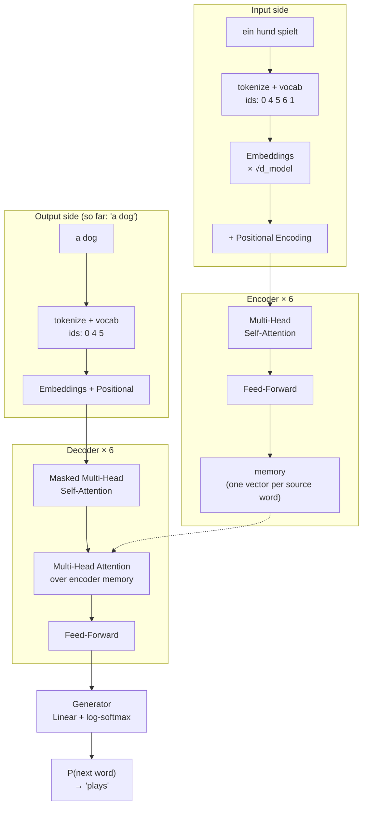

# Understanding the Annotated Transformer

This folder explains **every component** of the Transformer in
[`annotated_transformer/`](../annotated_transformer), in the order data actually
flows through it. Plain words, small diagrams, and a single worked example that
we carry from the first page to the last.

If you read these in order, by the end you will understand exactly what happens
when the model turns **"ein hund spielt"** into **"a dog plays"**.

---

## Reading order

| # | Page | Component | Code |
|---|------|-----------|------|
| 00 | [00-the-big-picture.md](00-the-big-picture.md) | How the pieces fit together | — |
| 01 | [01-tokenization-and-vocab.md](01-tokenization-and-vocab.md) | Text → tokens → numbers | [`data/tokenizer.py`](../annotated_transformer/data/tokenizer.py), [`data/vocab.py`](../annotated_transformer/data/vocab.py) |
| 02 | [02-batching-and-masking.md](02-batching-and-masking.md) | Padding, the `Batch` object, masks | [`data/dataloader.py`](../annotated_transformer/data/dataloader.py), [`data/batch.py`](../annotated_transformer/data/batch.py), [`model/masking.py`](../annotated_transformer/model/masking.py) |
| 03 | [03-embeddings.md](03-embeddings.md) | Numbers → vectors | [`model/embeddings.py`](../annotated_transformer/model/embeddings.py) |
| 04 | [04-positional-encoding.md](04-positional-encoding.md) | Adding a sense of order | [`model/embeddings.py`](../annotated_transformer/model/embeddings.py) |
| 05 | [05-scaled-dot-product-attention.md](05-scaled-dot-product-attention.md) | The core "look at other words" operation | [`model/attention.py`](../annotated_transformer/model/attention.py) |
| 06 | [06-multi-head-attention.md](06-multi-head-attention.md) | Doing attention 8 ways at once | [`model/attention.py`](../annotated_transformer/model/attention.py) |
| 07 | [07-position-wise-feed-forward.md](07-position-wise-feed-forward.md) | The per-word mini-MLP | [`model/feed_forward.py`](../annotated_transformer/model/feed_forward.py) |
| 08 | [08-layernorm-residual-dropout.md](08-layernorm-residual-dropout.md) | Keeping training stable | [`model/layers.py`](../annotated_transformer/model/layers.py) |
| 09 | [09-encoder-stack.md](09-encoder-stack.md) | Stacking 6 encoder layers | [`model/encoder.py`](../annotated_transformer/model/encoder.py) |
| 10 | [10-decoder-stack.md](10-decoder-stack.md) | Stacking 6 decoder layers | [`model/decoder.py`](../annotated_transformer/model/decoder.py) |
| 11 | [11-generator-and-full-model.md](11-generator-and-full-model.md) | Vectors → word probabilities, and the full wiring | [`model/encoder_decoder.py`](../annotated_transformer/model/encoder_decoder.py), [`model/build.py`](../annotated_transformer/model/build.py) |
| 12 | [12-label-smoothing.md](12-label-smoothing.md) | A gentler training target | [`training/label_smoothing.py`](../annotated_transformer/training/label_smoothing.py) |
| 13 | [13-optimizer-and-lr-schedule.md](13-optimizer-and-lr-schedule.md) | Adam + warmup | [`training/schedule.py`](../annotated_transformer/training/schedule.py) |
| 14 | [14-training-loop.md](14-training-loop.md) | `run_epoch`, loss, gradient accumulation | [`training/loop.py`](../annotated_transformer/training/loop.py), [`training/loss.py`](../annotated_transformer/training/loss.py) |
| 15 | [15-greedy-decoding.md](15-greedy-decoding.md) | Generating a translation one word at a time | [`inference/decode.py`](../annotated_transformer/inference/decode.py) |
| 16 | [16-attention-visualization.md](16-attention-visualization.md) | Seeing what the model looked at | [`viz/attention.py`](../annotated_transformer/viz/attention.py) |
| 17 | [17-papers-and-glossary.md](17-papers-and-glossary.md) | Every paper linked, every term defined | — |
| 18 | [18-evaluation-bleu-and-perplexity.md](18-evaluation-bleu-and-perplexity.md) | Measuring translation quality | [`evaluation/`](../annotated_transformer/evaluation/) |
| 19 | [19-running-experiments.md](19-running-experiments.md) | Train it yourself — GPU **or** CPU — and the 10/20/30-epoch study | [`scripts/run_experiments.py`](../scripts/run_experiments.py) |

---

## The running example

Everywhere in these docs we translate one tiny sentence:

```
German (source):   ein hund spielt
English (target):   a dog plays
```

We use four **special tokens**, always with these fixed ids:

| id | token | meaning |
|----|-------|---------|
| 0 | `<s>` | start of sentence |
| 1 | `</s>` | end of sentence |
| 2 | `<blank>` | padding (filler) |
| 3 | `<unk>` | unknown word |

And a tiny made-up vocabulary so the numbers stay readable:

| German | id | | English | id |
|--------|----|-|---------|----|
| ein | 4 | | a | 4 |
| hund | 5 | | dog | 5 |
| spielt | 6 | | plays | 6 |

> **Note on sizes.** The real model uses vectors of width `d_model = 512`. In the
> numeric examples we shrink that to `d_model = 4` (and `2` attention heads
> instead of `8`) so you can see every number. The *shapes* and *operations* are
> identical — only the width changes.

---

## The whole model on one screen



Each box has its own page. Start with [00-the-big-picture.md](00-the-big-picture.md).
