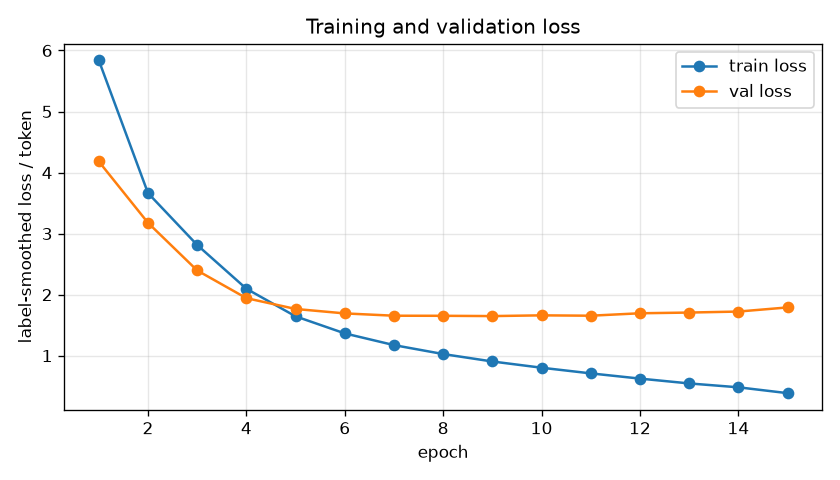
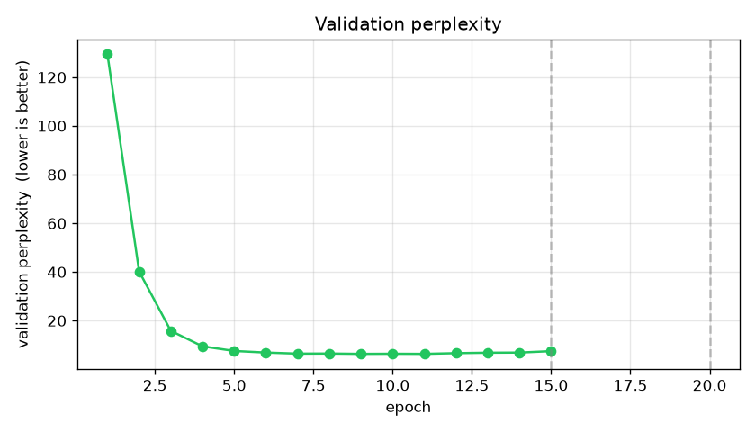
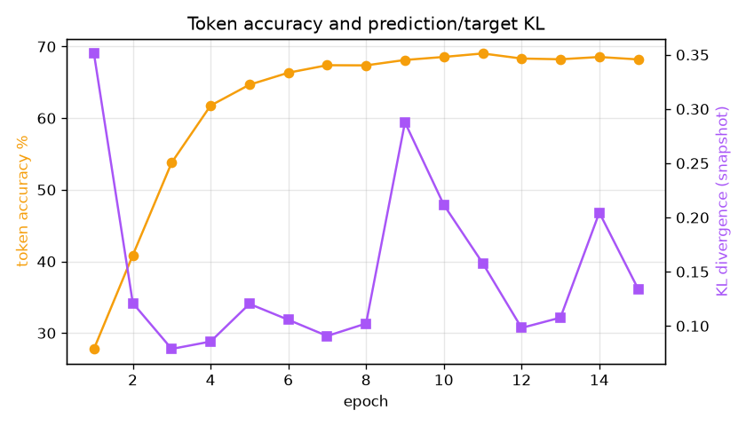
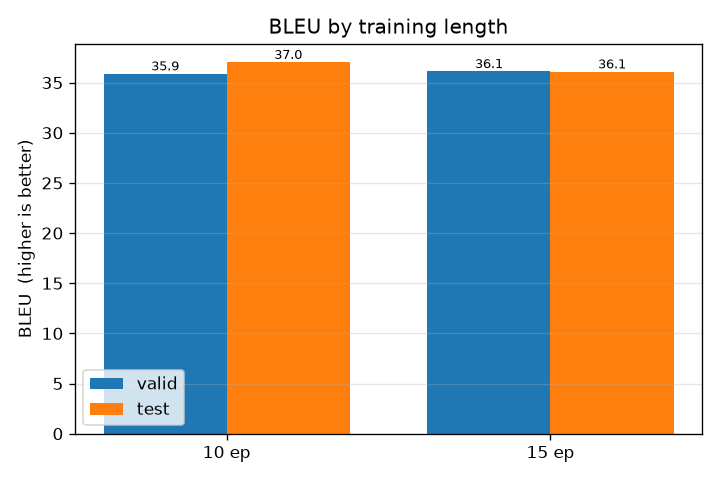
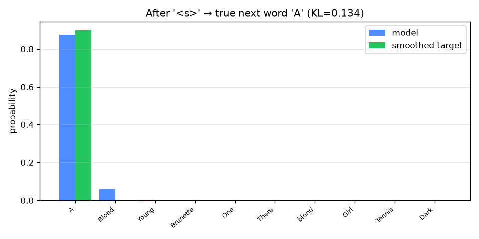

# Experiment comparison — German -> English — epochs 10, 15

German -> English, Multi30k. The model was checkpointed and fully evaluated (loss, perplexity, accuracy, KL, BLEU valid + test, sample translations) at epochs 10, 15.

## Configuration

```json
{
  "direction": "de->en",
  "dataset": "bentrevett/multi30k",
  "epochs": 20,
  "checkpoint_epochs": [
    15,
    20
  ],
  "batch_size": 32,
  "accum_iter": 10,
  "base_lr": 1.0,
  "warmup": 3000,
  "max_padding": 72,
  "n_layers": 6,
  "d_model": 512,
  "d_ff": 2048,
  "heads": 8,
  "dropout": 0.1,
  "seed": 42,
  "device": "cuda",
  "vocab_src": 19953,
  "vocab_tgt": 11158
}
```

## Headline results

| epochs | val loss | val perplexity | BLEU (valid) | BLEU (test) |
|-------:|---------:|---------------:|-------------:|------------:|
| 10 | 1.6609 | 6.42 | 35.90 | 37.04 |
| 15 | 1.7907 | 7.49 | 36.13 | 36.10 |

BLEU signature: `nrefs:1|case:mixed|eff:no|tok:13a|smooth:exp|version:2.6.0`

## Plots











## Reading of the results

- From 10 to 15 epochs, validation perplexity rose by 1.07 (6.42 -> 7.49).
- Test BLEU dropped by 0.94 (37.04 -> 36.10).
- Best test BLEU: **37.04** at 10 epochs.
- Gains flatten after 15 epochs (only +0.00 BLEU from 15 to 15) — likely near convergence / mild overfitting on this small dataset.

## Full per-epoch history

| epoch | train loss | val loss (KL) | perplexity | accuracy | KL snap | sec |
|------:|-----------:|-------------:|-----------:|---------:|--------:|----:|
| 1 | 5.8399 | 4.1821 | 129.47 | 27.8% | 0.351 | 339 |
| 2 | 3.6641 | 3.1769 | 40.24 | 40.9% | 0.121 | 341 |
| 3 | 2.8136 | 2.3963 | 15.84 | 53.8% | 0.079 | 336 |
| 4 | 2.0967 | 1.9425 | 9.46 | 61.8% | 0.086 | 336 |
| 5 | 1.6446 | 1.7654 | 7.56 | 64.7% | 0.120 | 337 |
| 6 | 1.3652 | 1.6927 | 6.91 | 66.3% | 0.106 | 336 |
| 7 | 1.1733 | 1.6549 | 6.46 | 67.4% | 0.091 | 336 |
| 8 | 1.0268 | 1.6535 | 6.51 | 67.4% | 0.102 | 336 |
| 9 | 0.9050 | 1.6489 | 6.37 | 68.1% | 0.288 | 336 |
| 10 | 0.8029 | 1.6609 | 6.42 | 68.5% | 0.212 | 336 |
| 11 | 0.7102 | 1.6550 | 6.37 | 69.0% | 0.158 | 339 |
| 12 | 0.6246 | 1.6949 | 6.65 | 68.3% | 0.098 | 334 |
| 13 | 0.5456 | 1.7067 | 6.84 | 68.2% | 0.108 | 335 |
| 14 | 0.4822 | 1.7230 | 6.90 | 68.5% | 0.204 | 335 |
| 15 | 0.3863 | 1.7907 | 7.49 | 68.2% | 0.134 | 337 |
