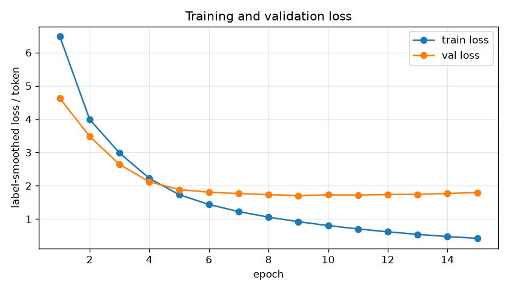
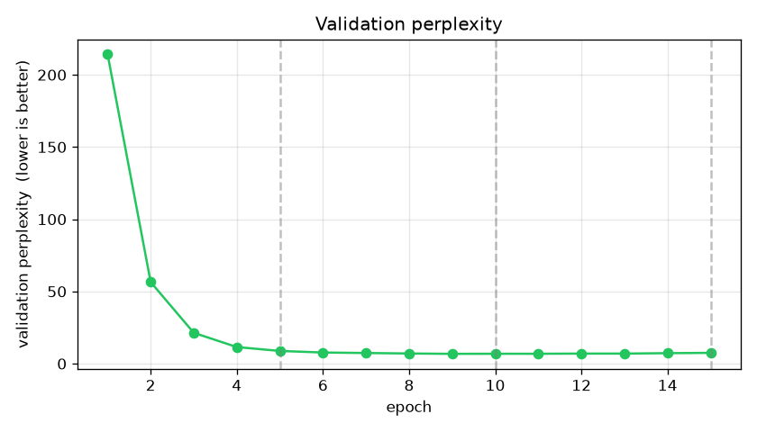
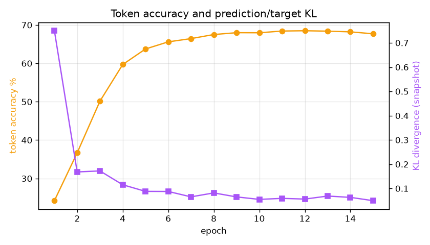
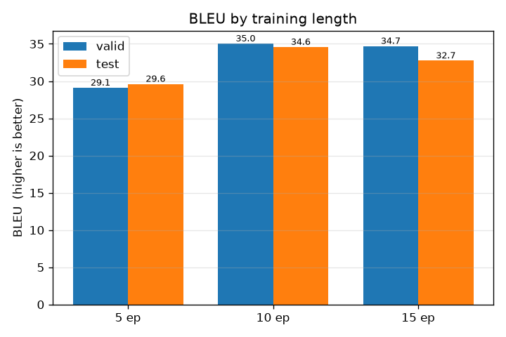
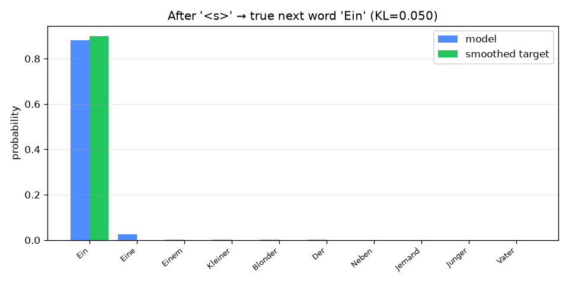

# Experiment comparison — English -> German — epochs 5, 10, 15

English -> German, Multi30k. The model was checkpointed and fully evaluated (loss, perplexity, accuracy, KL, BLEU valid + test, sample translations) at epochs 5, 10, 15.

## Configuration

```json
{
  "direction": "en-de",
  "dataset": "bentrevett/multi30k",
  "epochs": 15,
  "checkpoint_epochs": [
    5,
    10,
    15
  ],
  "batch_size": 32,
  "accum_iter": 10,
  "base_lr": 1.0,
  "warmup": 3000,
  "max_padding": 72,
  "n_layers": 6,
  "d_model": 512,
  "d_ff": 2048,
  "heads": 8,
  "dropout": 0.1,
  "seed": 42,
  "device": "cuda",
  "vocab_src": 11158,
  "vocab_tgt": 19953
}
```

## Headline results

| epochs | val loss | val perplexity | BLEU (valid) | BLEU (test) |
|-------:|---------:|---------------:|-------------:|------------:|
| 5 | 1.8854 | 8.80 | 29.10 | 29.61 |
| 10 | 1.7247 | 6.86 | 35.03 | 34.57 |
| 15 | 1.7942 | 7.48 | 34.70 | 32.74 |

BLEU signature: `nrefs:1|case:mixed|eff:no|tok:13a|smooth:exp|version:2.6.0`

## Plots











## Reading of the results

- From 5 to 15 epochs, validation perplexity fell by 1.32 (8.80 -> 7.48).
- Test BLEU improved by 3.13 (29.61 -> 32.74).
- Best test BLEU: **34.57** at 10 epochs.
- Gains flatten after 10 epochs (only +-1.83 BLEU from 10 to 15) — likely near convergence / mild overfitting on this small dataset.

## Full per-epoch history

| epoch | train loss | val loss (KL) | perplexity | accuracy | KL snap | sec |
|------:|-----------:|-------------:|-----------:|---------:|--------:|----:|
| 1 | 6.4848 | 4.6262 | 214.27 | 24.2% | 0.750 | 361 |
| 2 | 3.9924 | 3.4837 | 56.50 | 36.7% | 0.168 | 358 |
| 3 | 2.9851 | 2.6412 | 21.35 | 50.1% | 0.172 | 358 |
| 4 | 2.2221 | 2.1197 | 11.50 | 59.7% | 0.115 | 358 |
| 5 | 1.7329 | 1.8854 | 8.80 | 63.7% | 0.088 | 358 |
| 6 | 1.4360 | 1.8043 | 7.72 | 65.6% | 0.088 | 360 |
| 7 | 1.2224 | 1.7642 | 7.37 | 66.5% | 0.066 | 360 |
| 8 | 1.0554 | 1.7315 | 7.03 | 67.5% | 0.082 | 360 |
| 9 | 0.9192 | 1.7048 | 6.80 | 68.0% | 0.065 | 359 |
| 10 | 0.8018 | 1.7247 | 6.86 | 68.0% | 0.055 | 360 |
| 11 | 0.7015 | 1.7199 | 6.85 | 68.4% | 0.059 | 359 |
| 12 | 0.6134 | 1.7357 | 6.97 | 68.5% | 0.056 | 359 |
| 13 | 0.5385 | 1.7409 | 6.97 | 68.4% | 0.069 | 359 |
| 14 | 0.4723 | 1.7684 | 7.25 | 68.2% | 0.063 | 360 |
| 15 | 0.4181 | 1.7942 | 7.48 | 67.7% | 0.050 | 359 |
